# JNV Alumni Portal
## Enterprise Alumni Management Platform

---

**Product:** JNV Farrukhabad Alumni Portal  
**Version:** 1.5.0  
**Developed For:** Jawahar Navodaya Vidyalaya (JNV) Alumni Community  
**Developed By:** Alumni Tech Team  
**Document Type:** Technical Architecture and Product Report  
**Classification:** Confidential — Internal and Stakeholder Use Only  
**Report Date:** June 2026

---

**Contact**

- **Web:** https://alumni-portal.ashwanik.me
- **GitHub:** https://github.com/ashwanik0777/allumni-portal
- **LinkedIn:** linkedin.com/in/ashwanikushwaha

---

> *"Connecting generations. Empowering communities. Transforming institutions."*

---

## Confidentiality Statement

This document is prepared exclusively for authorized personnel, institutional decision-makers, technology partners, investors, and academic evaluators. The information contained herein — including architecture diagrams, module designs, security protocols, API specifications, and roadmap details — constitutes confidential intellectual property.

Unauthorized reproduction, redistribution, or disclosure of any portion of this document, in whole or in part, is strictly prohibited without the prior written consent of the development team.

Recipients of this document are expected to maintain confidentiality and use this information solely for purposes of product evaluation, institutional adoption, or technical partnership discussions.

---

## Document Control

| Property | Value |
|---|---|
| Document Title | JNV Alumni Portal — Enterprise Product Report |
| Document Version | 1.5.0 |
| Status | Final |
| Prepared By | Alumni Tech Team |
| Review Date | June 2026 |
| Classification | Confidential |
| Target Audience | Institutions, Investors, Partners, Evaluators |

---

## Version History

| Version | Date | Author | Change Description |
|---|---|---|---|
| 0.1.0 | January 2026 | Tech Team | Initial project scaffolding and architecture |
| 0.5.0 | February 2026 | Tech Team | Core modules implemented (Auth, Members, Events) |
| 1.0.0 | March 2026 | Tech Team | Full module release: Jobs, Scholarships, Mentorship |
| 1.2.0 | April 2026 | Tech Team | Security hardening: 2FA, Session management, Block list |
| 1.5.0 | June 2026 | Tech Team | Analytics, Email templates, Admin request workflows added |

---

## Table of Contents

1. Executive Summary
2. Introduction
3. Business Problem Statement
4. Proposed Solution
5. Project Vision and Objectives
6. Target Users and Personas
7. Real-World Use Cases
8. Product Overview
9. System Architecture
10. Technical Architecture
11. Technology Stack
12. Directory Structure
13. Public Website Modules
14. User Workspace Modules
15. Admin Workspace Modules
16. Authentication and Authorization
17. Role-Based Access Control
18. Database Architecture
19. Entity Relationship Design
20. API Architecture and Specifications
21. Security and Compliance
22. Performance Optimization
23. Scalability Strategy
24. Infrastructure and Deployment Architecture
25. CI/CD Strategy
26. Environment Configuration
27. Testing Strategy and Quality Assurance
28. Engineering Standards
29. Monitoring and Observability
30. Email Communication System
31. Business Value and Institutional Benefits
32. Reusability and Customization
33. Product Differentiators
34. Challenges and Solutions
35. Current Limitations
36. Future Roadmap
37. Conclusion
38. Appendix
39. Glossary

---

## 1. Executive Summary

The JNV Alumni Portal is a full-stack, enterprise-grade community management platform purpose-built to orchestrate relationships, workflows, and operations within alumni ecosystems. It connects alumni, students, and institutional administrators through a unified, secure, and scalable digital environment.

**The platform is designed with a reusable and modular architecture, allowing deployment for schools, colleges, universities, alumni networks, and broader institutional ecosystems without rebuilding from scratch.**

### What the Platform Does

At its core, the platform enables:

- Verified alumni registration and identity management
- Career services including a curated job board and mentorship matching
- Scholarship administration from fund planning through disbursement
- Community event management and registration
- Peer-to-peer networking and messaging
- Comprehensive admin control with analytics and reporting
- Automated email communication for every major workflow

### Key Architectural Strengths

| Dimension | Capability |
|---|---|
| Architecture | Modular, domain-isolated, component-driven |
| Security | JWT sessions, HttpOnly cookies, 2FA, role enforcement at edge |
| Scalability | Serverless-ready, connection-pooled, caching layer |
| Authentication | Cookie-based JWT with first-login password enforcement |
| Role Management | Strict binary role system (admin/user) with middleware interception |
| Email System | Branded HTML email templates for 8+ automated workflows |
| Database | PostgreSQL with indexed relational design, auto-provisioned tables |
| Frontend | Next.js App Router, React 19, Tailwind CSS v4, TypeScript strict mode |

### Technology Foundation

The platform is built on Next.js 16 with the App Router, React 19, TypeScript, Tailwind CSS v4, PostgreSQL, and Nodemailer. It is designed for serverless deployment on Vercel with optional Redis caching and S3-compatible object storage.

### Strategic Positioning

The Alumni Portal is not merely a directory application. It is a **community infrastructure platform** — capable of managing complex institutional workflows including financial disbursements, support escalation, mentorship coordination, and multi-layer identity verification. The system is equally suitable for:

- Jawahar Navodaya Vidyalayas and Navodaya alumni communities
- Any school, college, or university alumni network
- NGO membership management systems
- Professional community platforms
- Institutional event and program management

---

## 2. Introduction

### Why This Platform Was Built

Alumni communities across India and globally face a recurring challenge: they exist in fragmented, informal spaces — WhatsApp groups, Excel sheets, and outdated web pages — with no structured system to manage communication, career support, financial assistance, or institutional knowledge.

The JNV Farrukhabad Alumni Portal was conceived to solve this problem comprehensively. The institution needed a platform that would:

- Maintain a verified, searchable alumni directory
- Coordinate mentorship between experienced and early-career alumni
- Manage scholarship programs and financial disbursements
- Facilitate event coordination across graduating batches
- Provide administrators with visibility into community metrics

### The Digital Transformation Need

Institutions worldwide are undergoing digital transformation. Alumni engagement is increasingly recognized as a strategic asset — for fundraising, career placement, mentorship, and institutional reputation. Yet most smaller institutions lack the resources to procure enterprise alumni management software, which typically costs hundreds of thousands of dollars annually.

This platform provides an **open, deployable, production-grade alternative** — built with modern standards and designed to scale.

### What Makes This Different

Unlike simple directory websites or form-based portals, the JNV Alumni Portal implements:

- Multi-stage registration with admin verification workflows
- Secure, cookie-based authentication with role isolation at the middleware layer
- Real-time admin analytics with database-cached query results
- A fully automated email communication pipeline using branded HTML templates
- A job board with application tracking and pipeline visibility
- A mentorship system with mentor assignment notifications
- A scholarship management system supporting full lifecycle from creation to disbursement

---

## 3. Business Problem Statement

### The Current State of Alumni Management

Most educational institutions — particularly those outside large urban centers — manage their alumni relationships through entirely manual processes:

| Problem Area | Current Reality |
|---|---|
| Member Directory | Maintained in Excel or Google Sheets, frequently outdated |
| Registration | Manual form submissions via email or paper |
| Communication | Informal groups with no delivery tracking or segmentation |
| Career Support | Ad-hoc referrals with no structured job board |
| Mentorship | No formal matching system; depends on personal contacts |
| Scholarships | Managed through spreadsheets with no application tracking |
| Events | Announced through social media with manual RSVP collection |
| Analytics | None — no visibility into community health or engagement |
| Security | No role-based access; sensitive data in shared documents |

### Consequences of the Status Quo

These fragmented systems result in:

- **Lost alumni connections** — Members move, change contact details, and disappear from the community
- **Missed career opportunities** — Qualified candidates never see relevant job openings posted by fellow alumni
- **Inequitable scholarship distribution** — No transparent application process; awards based on informal selection
- **Administrative overload** — Staff spend disproportionate time on data entry and coordination tasks
- **Zero institutional memory** — Knowledge and contributions are not recorded systematically
- **Security exposure** — Sensitive personal information stored in unprotected shared files

### The Scale of the Problem

This problem is not unique to one institution. There are 649 Jawahar Navodaya Vidyalayas across India. Each has thousands of alumni. Nationally, India has over 40,000 higher educational institutions, most facing identical challenges. The addressable need for a deployable, modular alumni management platform is enormous.

---

## 4. Proposed Solution

### Core Solution Pillars

**1. Identity and Access Management**
A verified registration pipeline where every member is reviewed and approved by administrators before receiving platform access. Role-based access ensures clean separation between administrator and member capabilities.

**2. Community Infrastructure**
A searchable alumni directory, peer networking, and internal messaging system that replaces fragmented informal communication channels with structured, platform-native tools.

**3. Career Ecosystem**
An integrated job board where alumni can post and apply to opportunities, with application pipeline tracking from submission through offer stage. Paired with a mentorship matching system connecting mentees with experienced alumni based on professional focus area.

**4. Financial Administration**
A complete scholarship lifecycle management system: administrators create scholarship programs, configure eligibility criteria, review applications, and record disbursements — all within the platform.

**5. Event Management**
End-to-end event administration from creation through attendance management, with multi-status workflows (Pending, Approved, Rejected) and attendee registration tracking.

**6. Analytics and Intelligence**
A real-time analytics dashboard providing administrators with aggregated metrics across members, scholarships, events, and applications — with short-term caching for performance efficiency.

---

## 5. Project Vision and Objectives

### Vision

To become the definitive digital community infrastructure for alumni networks, educational institutions, and professional communities — enabling any organization to digitize and scale its alumni engagement operations through a single, deployable, production-ready platform.

### Primary Objectives

| Objective | Description |
|---|---|
| Centralized Management | Provide a single platform for all alumni operations |
| Secure Identity | Implement verified, role-based access with multi-layer authentication |
| Workflow Automation | Automate email notifications, status transitions, and approval flows |
| Career Enablement | Connect alumni with jobs and mentors through structured systems |
| Financial Transparency | Track scholarship programs and disbursements with full audit trails |
| Institutional Customization | Allow adaptation to any school, college, or organization |
| Scalable Architecture | Support thousands of users and millions of records without redesign |
| Developer Maintainability | Follow strict engineering standards for long-term code health |

### Design Principles

- **Security by Design** — Every route, API, and data access point is authenticated and authorized
- **Mobile-First** — All interfaces are designed for mobile devices first, then scaled upward
- **Performance First** — Edge caching, connection pooling, and lazy loading are built in
- **Modular Boundaries** — Admin, User, and Public contexts are strictly isolated
- **Minimal Dependencies** — Only essential packages are included to maintain lean build sizes

---

## 6. Target Users and Personas

### Primary User Categories

| User Type | Description | Primary Use Cases |
|---|---|---|
| Alumni (Employed) | Working professionals from the institution | Networking, mentoring, posting jobs, supporting scholarships |
| Alumni (Students) | Currently enrolled alumni pursuing higher education | Finding mentors, applying to jobs, accessing scholarships |
| Platform Administrator | Verified institutional authority | Member approval, event management, scholarship administration |
| Public Visitor | Unregistered visitor to the public website | Browsing directory, viewing events, initiating registration |

### Persona Profiles

**Aditi Verma — Senior Software Engineer, Microsoft**
Aditi is a 2015 alumna working in cloud infrastructure. She wants to give back to the community by mentoring juniors and occasionally posting job openings at her company. She logs in weekly to check mentorship requests and uses the alumni directory to reconnect with batchmates.

**Ritika Verma — Current Student, Class 2024**
Ritika recently registered on the portal seeking guidance on engineering entrance exams. She uses the mentorship module to connect with seniors, browses scholarship programs, and follows upcoming events to stay engaged with the community.

**Platform Administrator — JNV Portal Coordinator**
The administrator manages the daily operations of the platform. They review pending member registrations, moderate event submissions, manage scholarship programs, respond to support requests, and monitor community health through the analytics dashboard.

**Rohit Mishra — Product Manager, Flipkart**
Rohit is a 2012 alumnus who uses the portal primarily to post job opportunities for his team and to contribute to scholarship funding. He checks the platform quarterly and values the professional design and ease of use.

---

## 7. Real-World Use Cases

### Use Case 1: Alumni Registration and Onboarding

A recent graduate visits the portal, fills out the registration form with their batch year, house affiliation, and contact details, and submits for review. The administrator receives an email notification, reviews the submission in the admin panel, approves the member, and the system automatically sends the new member their login credentials and a welcome email.

### Use Case 2: Scholarship Discovery and Application

A current student logs in and browses active scholarship programs in the User Workspace. They select a relevant scholarship, review eligibility criteria, and submit an application with their academic details and supporting documents. The administrator reviews the application, marks it as Verified, and upon disbursement, marks it as Completed — triggering a status email to the applicant.

### Use Case 3: Career Mentorship Connection

A junior alumnus looking to transition from engineering to product management searches the Mentorship module for alumni working in product roles. They request mentorship from a Product Manager alumnus. The mentor receives a detailed email with the mentee's goals, career track, and urgency level, and connects with them to begin guidance.

### Use Case 4: Event Registration

The administrator creates a batch reunion event through the Admin Events module, setting capacity, date, location, and organizer contact. Alumni browsing the Events section register their interest. The administrator tracks attendee counts and registration statuses in real time.

### Use Case 5: Support Request Resolution

A member submits a support request about a technical issue with their profile. The administrator sees the ticket in the Requests module, updates its status to In Progress, adds an admin note, and upon resolution, marks it Resolved — triggering an automated email to the member with the status update and admin note.

### Institutional Adaptation Examples

| Institution Type | Adaptation |
|---|---|
| Navodaya Schools | Batch-based alumni network with house affiliation tracking |
| Engineering Colleges | Department-level mentorship and campus recruitment board |
| Universities | Multi-campus alumni directory with faculty networking |
| NGOs | Member management and donor-linked program administration |
| Professional Associations | Credential-verified membership with event and certification tracking |


---

## 8. Product Overview

The platform operates across three distinct, isolated contexts:

### 8.1 Public Website

The public-facing surface of the platform serves unregistered visitors and provides:

- **Landing Page** — Institution overview, platform value proposition, community statistics, and a unique live visitor counter
- **Alumni Directory** — Searchable, paginated directory of approved alumni with professional profiles
- **Events Page** — Upcoming community events with details and registration prompts
- **Scholarships Page** — Public listing of active scholarship programs with eligibility and application information
- **Jobs Board** — Publicly visible job listings posted by alumni (authentication required to apply)
- **About Page** — Institutional history, mission, and team information
- **Contact / Support** — Support form with automated acknowledgment and admin notification
- **Donate** — Fundraising interface for community support
- **Share Story** — Platform for alumni to submit testimonials and community contributions
- **News and Updates** — Community announcements and institutional news
- **Privacy and Terms** — Compliance pages

### 8.2 User Workspace

The authenticated member workspace, accessible only after admin-verified registration:

- **Overview Dashboard** — Personalized summary of connections, applications, and mentorship activity
- **My Profile** — Complete profile editor supporting both student and employed profile types, with 30+ data fields
- **My Network** — Alumni connection management with block/unblock capability
- **Mentorship (Seeker)** — Browse available mentors, submit mentorship requests, track request status
- **Mentor Dashboard** — For approved mentors: view assigned mentees, manage mentorship requests
- **Jobs** — Browse active listings, apply with one click, track application pipeline
- **Events** — Browse and register for community events
- **Scholarships** — Discover and apply for scholarship programs
- **Messages** — Internal peer-to-peer messaging with conversation threading
- **Settings** — Profile visibility, notification preferences, timezone configuration, security settings

### 8.3 Admin Workspace

The secure administrative control center:

- **Overview** — High-level dashboard with community KPIs and recent activity
- **Members** — Registration approval queue with multi-status management
- **Requests** — Support ticket management with priority classification and status tracking
- **Mentorship** — Admin-side mentorship program oversight and mentor assignment
- **Events** — Event submission review, approval, and attendee management
- **Scholarships** — Scholarship program creation, eligibility configuration, application review, and disbursement tracking
- **Website** — CMS-style content management for public-facing pages
- **Analytics** — Real-time metrics dashboard with scholarship trends, member growth, and application analytics
- **Settings** — Platform configuration, access statistics, workflow metrics

---

## 9. System Architecture

### 9.1 Macro Architecture Model

The platform follows an edge-optimized, domain-isolated architecture where static and public content is served through CDN edge nodes, while authenticated operational workflows run through strictly validated dynamic server routes.

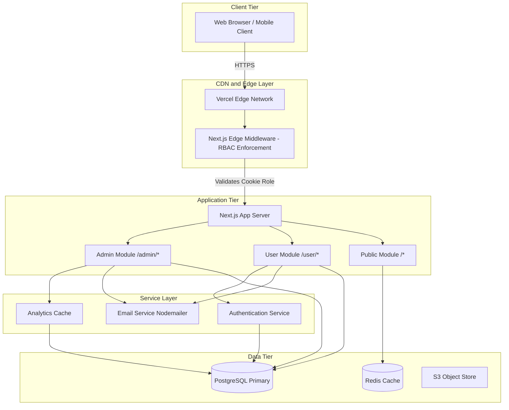

### 9.2 Domain Boundary Model

```mermaid
flowchart LR
    subgraph PublicDomain["Public Domain"]
        Landing["Landing Page"]
        Dir["Alumni Directory"]
        Ev["Events"]
        JobsPub["Jobs Preview"]
        Sch["Scholarships"]
        Con["Contact"]
    end

    subgraph UserWS["User Workspace"]
        UProfile["Profile"]
        UNet["My Network"]
        UMent["Mentorship"]
        UJobs["Jobs and Apply"]
        UMsg["Messages"]
        USchol["Scholarship Apply"]
    end

    subgraph AdminWS["Admin Workspace"]
        AOver["Overview"]
        AMem["Member Queue"]
        AReq["Support Tickets"]
        AEv["Event Review"]
        ASchol["Scholarship Admin"]
        AAnal["Analytics"]
        ASet["Settings"]
    end

    Guest -->|Open Access| PublicDomain
    Guest -->|Registration| Register["Registration Form"]
    Register -->|Admin Approval| UserWS
    UserWS -.->|No Access| AdminWS
```

---

## 10. Technical Architecture

### 10.1 Frontend Architecture

The frontend is built on the Next.js App Router paradigm, which provides React Server Components (RSC) by default. This architecture delivers significant performance benefits:

- **Server Components** handle data fetching directly on the server, eliminating client-side data waterfalls
- **Client Components** are used selectively for interactive elements like sidebars, forms, and dynamic UI states
- **Layouts** at the route level provide shared UI shells that persist across page navigations
- **Loading States** provide Suspense-based skeleton screens during server data fetches

### 10.2 Backend Architecture

The backend operates entirely through Next.js Route Handlers — serverless functions that execute on-demand. Each Route Handler:

- Validates the incoming request against a defined schema
- Checks authentication through cookie parsing
- Executes the required database operations via the connection pool
- Returns a typed JSON response

The backend is organized into domain-specific service modules in the `/lib` directory, each encapsulating table initialization, data seeding, query execution, and data mapping.

### 10.3 Middleware Architecture

The `proxy.ts` middleware runs at the Vercel Edge and enforces Role-Based Access Control before any request reaches the application server:

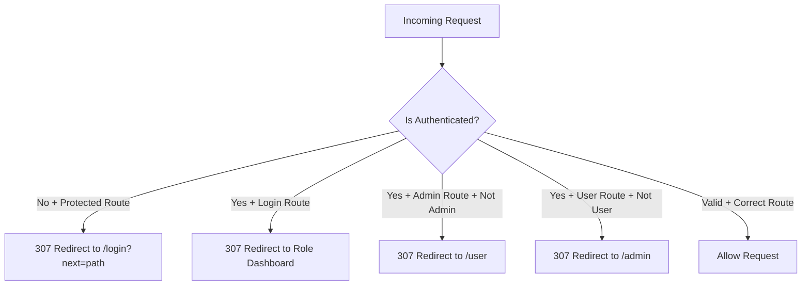

The middleware reads two cookies — `auth_user` (active status) and `auth_role` (admin or user) — and enforces four security invariants:

1. Unauthenticated users cannot access `/admin/*` or `/user/*`
2. Authenticated users are redirected away from `/login`
3. Non-admin users are redirected away from `/admin/*`
4. Non-user roles are redirected away from `/user/*`

### 10.4 Database Connection Architecture

The database connection uses a singleton pool pattern to prevent connection exhaustion in serverless environments, with SSL mode automatically upgraded to `verify-full` for secure connections.

---

## 11. Technology Stack

### Core Technologies

| Layer | Technology | Version | Purpose |
|---|---|---|---|
| Framework | Next.js | 16.1.1 | Full-stack React framework with App Router |
| UI Library | React | 19.2.3 | Component model and server rendering |
| Language | TypeScript | 5.0+ | Strict type safety across entire codebase |
| Styling | Tailwind CSS | v4 | Utility-first CSS with custom design tokens |
| Icons | Lucide React | 0.562.0 | Consistent icon library |
| Database Driver | pg (node-postgres) | 8.20.0 | PostgreSQL connection pool |
| Email | Nodemailer | 8.0.11 | SMTP email delivery |

### Infrastructure (Production Targets)

| Layer | Technology | Purpose |
|---|---|---|
| Hosting | Vercel | Serverless deployment with global CDN |
| Database | PostgreSQL | Primary relational data store |
| Caching | Redis (Upstash) | Session validation, rate limiting |
| Object Storage | AWS S3 / MinIO | Profile pictures, resume uploads |
| Email Gateway | SMTP (SendGrid/Gmail) | Transactional email delivery |

### Design System Tokens

| Token | Value | Usage |
|---|---|---|
| Primary Color | Royal Blue `#1E348A` | Primary actions, active states |
| Primary Light | Light Blue `#93C5FD` | Hover states, backgrounds |
| Secondary Color | Gold `#C9A227` | Accent highlights |
| Background Light | Off-White `#F8F9F4` | Page backgrounds |
| Background Dark | Deep Blue `#1F2957` | Card and panel backgrounds |

---

## 12. Directory Structure

```
/alumni-portal/
├── proxy.ts                    # Edge Middleware: RBAC enforcement at Vercel Edge
├── next.config.ts              # Webpack, image domain, compiler configuration
├── package.json                # Dependency manifest and script definitions
├── tsconfig.json               # TypeScript strict mode configuration
├── postcss.config.mjs          # CSS processing pipeline
├── eslint.config.mjs           # Linting rules and code quality configuration
├── project_rules.md            # Internal engineering guidelines
│
├── /public/                    # Static assets (served at root domain, CDN-cached)
│   └── counter.json            # Visitor analytics persistence store
│
├── /scripts/                   # Operational and CI/CD utilities
│   └── seed-auth-account.cjs   # Admin credential seeding script
│
├── /lib/                       # Shared service layer (backend logic)
│   ├── postgres.ts             # Database pool singleton (max 5 connections)
│   ├── password.ts             # Password hashing (bcrypt/Argon2)
│   ├── mailer.ts               # Email service with 8+ branded HTML templates
│   ├── admin-analytics.ts      # Analytics aggregation with 15-second cache
│   ├── admin-api-guard.ts      # Server-side admin authorization wrapper
│   ├── admin-events.ts         # Event CRUD, approval workflows, attendee management
│   ├── admin-members.ts        # Registration queue, approval, rejection logic
│   ├── admin-programs.ts       # Program lifecycle management
│   ├── admin-requests.ts       # Support ticket system with priority and status
│   ├── admin-scholarships.ts   # Scholarship and disbursement administration
│   ├── admin-settings-stats.ts # Platform health metrics with caching
│   ├── admin-state.ts          # Admin state utilities
│   ├── admin-web.ts            # CMS content management helpers
│   ├── user-api-guard.ts       # Server-side user authorization wrapper
│   ├── user-connections.ts     # Alumni networking and block management
│   ├── user-jobs.ts            # Job board, applications, pipeline tracking
│   ├── user-mentorship.ts      # Mentor discovery and request management
│   ├── user-messages.ts        # Peer-to-peer messaging threads
│   ├── user-overview.ts        # User dashboard aggregations
│   ├── user-profile.ts         # Profile CRUD, username generation, settings
│   ├── user-security.ts        # Sessions, 2FA, blocked users
│   ├── mentorship.ts           # Admin-side mentorship utilities
│   ├── mentorship-chat.ts      # Mentorship conversation context
│   ├── home-data.ts            # Public homepage data aggregation
│   ├── news-mentorship-data.ts # News and community content
│   └── site-content.ts         # Static site content and configuration
│
└── /app/                       # Next.js App Router root
    ├── globals.css             # Global CSS variables and Tailwind injection
    ├── layout.tsx              # Root HTML/body, font loading, context providers
    ├── page.tsx                # Public landing page (SSR)
    ├── /components/            # Global reusable UI components
    │   ├── Navbar.tsx          # Responsive public navigation
    │   ├── Footer.tsx          # Site-wide footer
    │   └── UniqueViewerCounter.tsx  # Live visitor counter component
    ├── /api/                   # Route handlers (Serverless API endpoints)
    │   ├── /admin/             # Admin-only REST API namespace (10 sub-namespaces)
    │   ├── /auth/              # Authentication endpoints (login, register, 2FA, set-password)
    │   ├── /user/              # User API namespace (10 sub-namespaces)
    │   ├── /counter/           # Public visitor analytics API
    │   ├── /directory/         # Public alumni directory API
    │   └── /scholarships/      # Public scholarship listing API
    ├── /admin/                 # Admin Workspace (authenticated, 9 modules)
    ├── /user/                  # User Workspace (authenticated, 10 modules)
    ├── /login/                 # Authentication view
    ├── /register/              # Registration intake form
    ├── /about/                 # Public institutional page
    ├── /directory/             # Public alumni directory
    ├── /jobs/                  # Public job listings preview
    ├── /events/                # Public events listing
    ├── /scholarships/          # Public scholarship listing
    ├── /donate/                # Public fundraising page
    ├── /contact/               # Support contact form
    ├── /news/                  # Community news
    ├── /share-story/           # Alumni story submission
    ├── /team/                  # Team and contributors
    ├── /privacy/               # Privacy policy
    └── /terms/                 # Terms of service
```


---

## 13. Public Website Modules

### Landing Page

The public landing page functions as the primary discovery and conversion surface. It includes institution branding and visual identity, community value proposition, a live visitor counter (unique, persistent across sessions), community statistics, and call-to-action flows for registration and directory browsing.

### Alumni Directory

A fully searchable, paginated directory of approved alumni profiles. Features filter by batch year, profession, company, and location. Profile cards show name, current role, company, and batch. Authentication gate ensures profile details are visible only to logged-in members. API-driven pagination supports `GET /api/directory?page=1&limit=20&batch=2021&company=Microsoft`.

### Events Module (Public)

Displays approved, upcoming community events showing title, event type, date, location, and mode (Online/Offline), organizer contact information, and registration prompts directing to the user workspace for registered members.

### Scholarships Module (Public)

Publicly lists active scholarship programs with program name, amount, provider information, eligibility criteria, application deadline, contact information, and application links directing to the user workspace.

### Jobs Board (Public Preview)

Displays active job postings from alumni with job title, company, location type (Remote/Hybrid/On-site), compensation range, and role description. The Apply button requires authentication.

### Contact and Support

A structured support form collecting name, email, batch year, support type, and message. Delivers dual emails: admin notification with all details and an automated acknowledgment to the submitter. Response time SLA disclosure: General queries 24h, Event coordination 12h, Urgent requests 4h.

---

## 14. User Workspace Modules

### User Dashboard (Overview)

A personalized entry point summarizing active mentorship relationships and pending requests, job application pipeline summary, recent connections and messages, and upcoming events and scholarship deadlines.

### Profile Management

A comprehensive profile editor supporting two profile types:

**Student Profile Fields:** Course, specialization, institution, year/semester, expected graduation, CGPA, goals.

**Employed Profile Fields:** Job title, company, employment type, industry, experience years, work location, key skills, achievements.

**Common Fields (Both Types):** Full name, email, passing year, house affiliation, mobile, father's name, city, state, country, bio, interests, LinkedIn, GitHub, portfolio, certifications, languages.

**Username System:** Each user receives a unique 8-character username. Maximum 2 allowed username changes enforced at database level.

### Networking (My Network)

An alumni connection management system enabling browsing and connecting with verified alumni, viewing connection status (Connected, Pending, Not Connected), blocking and unblocking users with bilateral block enforcement, and viewing profiles of connected alumni.

### Mentorship (Seeker View)

Browse available mentors filtered by focus area. View mentor profiles showing role, company, availability, and focus area. Submit mentorship requests with a unique constraint of one request per mentor-mentee pair. Track request status: Pending, Active, Completed, Cancelled.

### Mentor Dashboard (Conditional)

Only visible to users registered as active mentors. Shows assigned mentees with contact details and goals, mentee information including track, stage, and urgency level. Mentor assignment triggers automated email notification to mentor.

### Jobs Module

Complete job board and application management. Browse active listings with company, location, mode, and compensation. Apply with one click (unique constraint per job-applicant pair). Track application pipeline: Saved, Applied, Interview, Offer, Rejected. Dashboard summary shows total applications, interview count, and offer count.

### Events Module (User)

Browse and register for approved community events. Track registration status: Going, Interested, Cancelled. View event details and organizer contacts.

### Scholarships Module (User)

Browse active scholarship programs with full eligibility details. Submit applications with academic information and documentation. Track application status: Pending, Verified, Completed.

### Messages

Internal peer-to-peer messaging system with conversation threading and timestamp tracking. Block enforcement integration prevents blocked users from sending messages. Read/unread state management.

### User Settings

| Setting Category | Options |
|---|---|
| Profile Visibility | Alumni-only, Public, Private |
| Data Visibility | Show email, Show mobile, Show current role |
| Notifications | Email updates, Mentorship alerts, Jobs alerts, Events alerts, Message notifications, Weekly digest |
| Interface | Compact layout, Timezone configuration |
| Security | Active session management, Password change, 2FA toggle |

---

## 15. Admin Workspace Modules

### Admin Overview (Dashboard)

A high-level command center providing total members, pending registrations, active events, scholarship programs, recent registration submissions requiring action, and quick action shortcuts to most-used admin functions.

### Members Management

The identity verification hub with paginated member queue with search, status filter, and batch filter. Status management covers Pending, Approved, Rejected, and Needs Info. Rejection reason capture for declined applications. Approval action triggers automated account creation and credential email dispatch. Summary counters show Pending / Approved / Rejected at a glance.

### Support Request Management

| Field | Options |
|---|---|
| Category | Support, Feedback, Bug Report, Feature Request, Account, Other |
| Priority | Low, Medium, High, Critical |
| Status | Open, In Progress, Resolved, Closed |

Full-text search across requester name, email, and subject. Admin note field for internal communications. Status change triggers automated email to requester with admin note.

### Event Administration

End-to-end event lifecycle management: review submitted event proposals, view attendee lists with registration status per event, track going/interested/cancelled counts, approval workflow with optional rejection reason, filter by status, year, and search.

### Scholarship Administration

Complete scholarship lifecycle: create programs with provider names, eligibility criteria, seats, deadline, and contact; activate/deactivate scholarships; review applications with full applicant information; status transitions from Pending to Verified to Completed; add admin notes to applications; track disbursed funding totals.

### Analytics Dashboard

Real-time analytics with 15-second result caching:

| Metric Category | Available Data |
|---|---|
| Overview | Total members, events, programs, scholarships, applications, funding |
| Members | Distribution by status |
| Scholarships | Count and funding by year |
| Applications | Distribution by status and course |
| Events | Distribution by status |
| Monthly Trends | 6-month application and completion trend |
| Top Scholarships | Ranked by application volume |
| Recent Activity | Latest 5 scholarship applications |

### Platform Settings

| Metric | Description |
|---|---|
| Member Verification Rate | Approved / Total members percentage |
| Scholarship Review Rate | Active / Total scholarships percentage |
| Application Completion Rate | Completed / Total applications percentage |
| Program Active Rate | Active / Total programs percentage |
| Total Records | Aggregate count across all primary tables |

---

## 16. Authentication and Authorization

### Registration and Onboarding Workflow

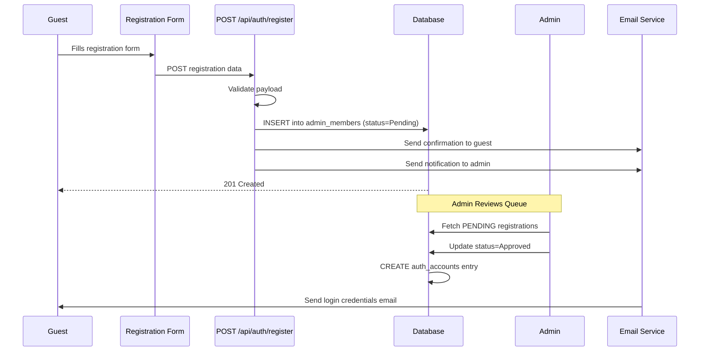

### Login and Authentication Flow

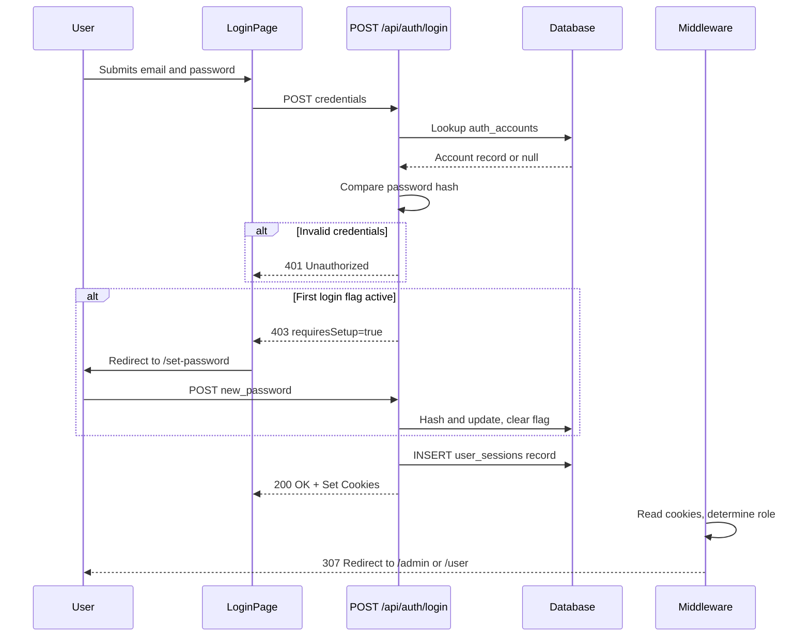

### Authentication Protocol

| Component | Implementation |
|---|---|
| Session Token | 256-bit cryptographically random token via `crypto.randomBytes(32)` |
| Cookie: `auth_user` | Value: `active`, signals authenticated state |
| Cookie: `auth_role` | Value: `admin` or `user`, signals authorization level |
| Cookie: `auth_email` | Value: user email, used for session lookup |
| First Login Gate | `pending_first_login` flag forces password change before full access |
| Session Persistence | Stored in `user_sessions` table with `last_active` timestamp |
| Session Revocation | Individual, selective, or bulk revocation supported |

### Two-Factor Authentication

The platform implements OTP-based 2FA: `two_factor_enabled` flag per account, OTP stored with `two_factor_otp_expiry` timestamp, OTP delivered via branded email template with 5-minute expiry, verification through `POST /api/auth/verify-2fa`.

---

## 17. Role-Based Access Control

### RBAC Architecture

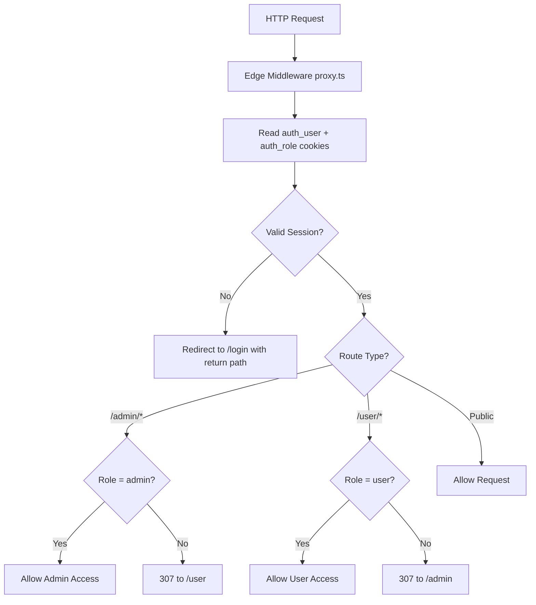

### Role Permission Matrix

| Feature / Action | Public | User | Admin |
|---|---|---|---|
| View alumni directory | Partial | Full | Full |
| Register as member | Yes | N/A | N/A |
| Edit own profile | No | Yes | No |
| Submit mentorship request | No | Yes | No |
| View mentor dashboard | No | Conditional | No |
| Apply to jobs | No | Yes | No |
| Apply for scholarships | No | Yes | No |
| Internal messaging | No | Yes | No |
| Manage active sessions | No | Yes | No |
| Enable 2FA | No | Yes | No |
| Approve member registrations | No | No | Yes |
| Manage events | No | No | Yes |
| Create scholarships | No | No | Yes |
| View platform analytics | No | No | Yes |
| Configure platform settings | No | No | Yes |
| Manage support tickets | No | No | Yes |
| Assign mentors | No | No | Yes |

### Route Protection Summary

| Route Pattern | Protection Level |
|---|---|
| `/*` | Open (public) |
| `/login` | Redirect to dashboard if authenticated |
| `/register` | Open |
| `/user/*` | Requires authentication + user role |
| `/admin/*` | Requires authentication + admin role |
| `/api/auth/*` | Rate-limited, schema validated |
| `/api/user/*` | Requires `auth_user = active` cookie |
| `/api/admin/*` | Requires `auth_user = active` + admin role check |

---

## 18. Database Architecture

### Design Philosophy

The database is designed following Third Normal Form (3NF) relational principles. Key design decisions:

- **BIGSERIAL Primary Keys** — Consistent auto-incrementing identifier strategy
- **TIMESTAMPTZ** — All timestamps stored in UTC with timezone information
- **Indexed Foreign Keys** — All join columns are indexed for query performance
- **CHECK Constraints** — Enforce valid status and stage values
- **ON DELETE CASCADE** — Referential integrity maintained automatically
- **Auto-provisioning** — Tables created programmatically on first access via `CREATE TABLE IF NOT EXISTS`
- **Seed Data** — Realistic demonstration data seeded automatically when tables are empty

### Database Tables Overview

| Table | Purpose | Key Constraints |
|---|---|---|
| `auth_accounts` | Authentication credentials and 2FA configuration | Unique email, 2FA columns |
| `admin_members` | Registration submissions and approval status | Status CHECK constraint |
| `user_profiles` | Extended profile data (30+ fields, two profile types) | Unique email, unique username |
| `user_sessions` | Active session tracking with device information | Unique session_token, is_active flag |
| `blocked_users` | Bilateral user block relationships | Unique blocker+blocked pair |
| `mentor_profiles` | Active mentor registry with focus areas | Unique email, is_active flag |
| `mentorship_requests` | Mentee-mentor pairing requests | Unique mentor+mentee pair, status CHECK |
| `job_listings` | Alumni-posted job opportunities | is_active flag |
| `job_applications` | User applications with stage tracking | Unique job+applicant pair, stage CHECK |
| `admin_scholarships` | Scholarship program definitions | is_active flag, amount constraint |
| `scholarship_applications` | Student scholarship applications | Foreign key to scholarships, status CHECK |
| `admin_events` | Community event definitions | Status CHECK, mode CHECK |
| `event_attendees` | Event registration records | Unique event+attendee pair, status CHECK |
| `admin_programs` | Community program management | Status CHECK |
| `admin_requests` | Support ticket system | Priority + Status CHECK constraints |

---

## 19. Entity Relationship Design

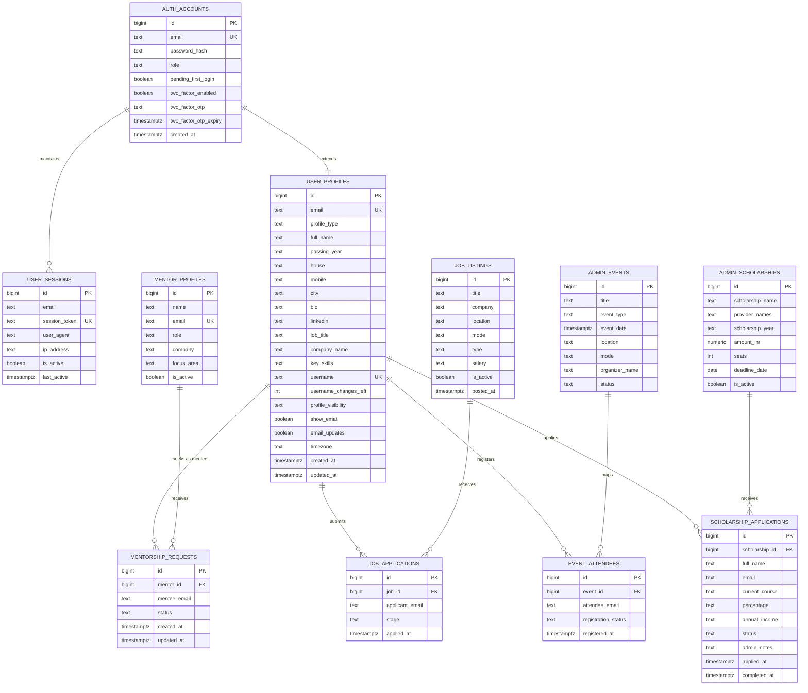

---

## 20. API Architecture and Specifications

### API Design Principles

- **Transport:** HTTPS only, `application/json` content type
- **Authentication:** Cookie-based session validation on every protected endpoint
- **Authorization:** Role check in each handler before data access
- **Error Handling:** Consistent error response shape with HTTP status codes
- **Input Validation:** Payload schema validation before any processing

### API Flow Architecture

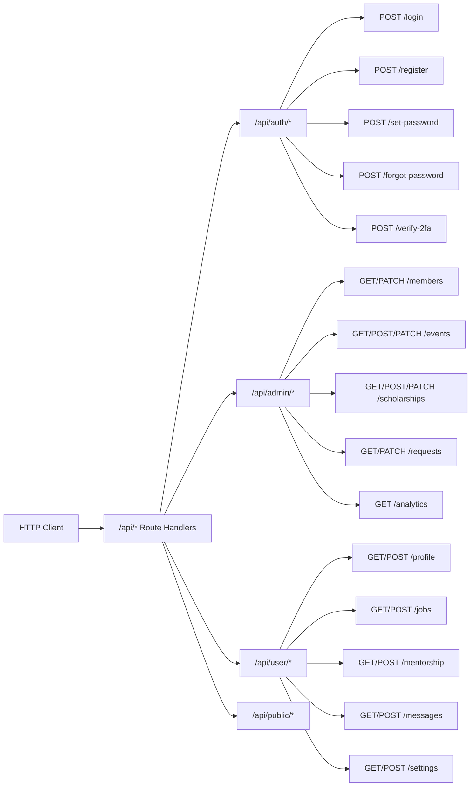

### Key API Specifications

#### POST /api/auth/login

**Request:**
```json
{
  "email": "alumni@example.com",
  "password": "SecurePassword123!"
}
```

**Response 200 OK:**
```json
{
  "status": "success",
  "user": { "id": "1234", "role": "user", "requiresSetup": false }
}
```

**Response 403 — First Login:**
```json
{ "status": "setup_required", "requiresSetup": true }
```

#### GET /api/directory

**Query Parameters:** `?page=1&limit=20&batch=2021&company=Microsoft`

**Response 200 OK:**
```json
{
  "data": [
    {
      "id": "123",
      "fullName": "Aditi Verma",
      "batch": "2015",
      "jobTitle": "Senior Software Engineer",
      "company": "Microsoft",
      "location": "Bengaluru"
    }
  ],
  "meta": { "totalItems": 1500, "totalPages": 75, "currentPage": 1 }
}
```

#### PATCH /api/admin/members/:id

**Request:**
```json
{ "status": "Approved", "reason": null }
```

**Response 200 OK:**
```json
{
  "success": true,
  "member": { "id": "456", "status": "Approved", "updatedAt": "2026-06-14T10:00:00Z" }
}
```

#### GET /api/admin/analytics

**Response 200 OK:**
```json
{
  "overview": {
    "totalMembers": 347,
    "totalEvents": 12,
    "totalScholarships": 8,
    "activeScholarships": 5,
    "totalApplications": 89,
    "totalFundingInr": 2500000,
    "disbursedFundingInr": 1800000
  },
  "membersByStatus": [...],
  "monthlyTrend": [...],
  "topScholarships": [...]
}
```

#### POST /api/user/mentorship

**Request:** `{ "mentorId": "789" }`

**Response 200 OK:** `{ "ok": true }`

**Response 400 — Already Requested:** `{ "ok": false, "reason": "Request already exists." }`

#### PATCH /api/admin/requests/:id

**Request:**
```json
{
  "status": "Resolved",
  "adminNote": "Issue resolved by clearing browser cache."
}
```

**Response 200 OK:** `{ "success": true, "updatedAt": "2026-06-14T12:00:00Z" }`

### Standard HTTP Status Codes

| Code | Usage |
|---|---|
| 200 | Successful operation |
| 201 | Resource created |
| 307 | Temporary redirect (middleware RBAC) |
| 400 | Validation failure or bad request |
| 401 | Authentication required |
| 403 | Authorization failure |
| 404 | Resource not found |
| 409 | Conflict — duplicate resource |
| 500 | Internal server error |


---

## 21. Security and Compliance

### Security Architecture Overview

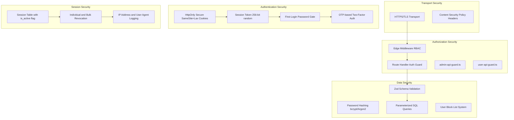

### Security Controls Inventory

| Control | Implementation | Threat Addressed |
|---|---|---|
| Transport Security | HTTPS/TLS (Vercel enforced) | Man-in-the-middle attacks |
| Cookie Security | `HttpOnly`, `Secure`, `SameSite=Lax` | XSS token theft, CSRF |
| Password Storage | bcrypt/Argon2 hash (not plaintext) | Credential exposure |
| SQL Injection Prevention | Parameterized queries via `pg` pool | Database injection |
| Input Validation | Zod schema validation on all API inputs | Malformed payload attacks |
| RBAC | Edge Middleware enforcement before server | Unauthorized access |
| First-Login Gate | `pending_first_login` flag with forced reset | Credential compromise |
| Two-Factor Auth | Time-limited OTP via email (5 min expiry) | Account takeover |
| Session Management | Database-persisted tokens with revocation | Session hijacking |
| User Blocking | Bilateral block enforcement in messaging | Harassment and abuse |
| Content Security Policy | Headers via `next.config.ts` | XSS execution |
| Role Isolation | Binary admin/user roles with no overlap | Privilege escalation |
| IP Logging | Session creation records IP address | Forensic investigation |

### Authentication Security Deep Dive

**Layer 1 — Credential Validation**
Email and password are validated against the `auth_accounts` table. Passwords are compared against stored hashes using constant-time comparison to prevent timing attacks.

**Layer 2 — First-Login Enforcement**
Every admin-created account carries a `pending_first_login = true` flag. On first login, the user is redirected to a mandatory password change flow. The flag is only cleared after a new, user-chosen password is set.

**Layer 3 — Session Creation**
A 256-bit random token is generated using Node.js `crypto.randomBytes(32)`. This token is stored in the `user_sessions` table alongside IP address, user agent, and creation timestamp.

**Layer 4 — Cookie Delivery**
Session state is communicated through three cookies: `auth_user` (active), `auth_role` (admin/user), and `auth_email`. All cookies are set with `HttpOnly` and `Secure` flags.

**Layer 5 — Edge Enforcement**
Every subsequent request passes through the Edge Middleware before reaching the server. Invalid or mismatched cookies result in immediate 307 redirects.

**Layer 6 — Two-Factor Authentication**
Users with 2FA enabled receive a time-limited OTP (5-minute expiry) delivered to their registered email. The OTP is stored in the database and cleared after successful verification.

---

## 22. Performance Optimization

### Caching Strategy

The platform implements a multi-level caching strategy:

**Analytics Cache (Application-Level)**
The `getAnalyticsData()` function stores computed results in server memory with a 15-second TTL. This prevents repeated expensive aggregation queries that join across 5+ tables.

**Settings Stats Cache (Application-Level)**
Platform health metrics in the Settings module use a similar 15-second in-memory cache, preventing repeated COUNT queries across all primary tables.

**Members List Cache (Application-Level)**
The member list query uses a Map-based cache with 12-second TTL, keyed by filter combination string.

### Database Performance

| Optimization | Implementation |
|---|---|
| Connection Pooling | Max 5 connections per serverless instance |
| Indexed Queries | All email lookups, foreign key joins, and status filters use B-Tree indexes |
| Parallel Queries | `Promise.all()` used for all multi-table analytics queries |
| Selective Columns | Only required columns selected |
| Pagination | All list endpoints use LIMIT/OFFSET with total count |

### Frontend Performance

| Optimization | Implementation |
|---|---|
| React Server Components | Data fetching on server, reducing client bundle |
| Edge Caching | Static pages served from Vercel Edge CDN |
| Lazy Loading | Client components loaded on demand |
| Mobile-First CSS | Tailwind CSS v4 with minimal class output |
| Minimal Dependencies | Only 5 production dependencies |
| Suspense Boundaries | `loading.tsx` files provide skeleton UI during fetches |

---

## 23. Scalability Strategy

### Horizontal Scalability

- **Stateless API Handlers** — No server-side state between requests; all state in database or cookies
- **Connection Pool Bounding** — `max: 5` connections per instance prevents database exhaustion
- **Edge Middleware** — RBAC runs at Vercel's global edge, distributing authentication load geographically
- **CDN-Cached Assets** — Static and public pages served from edge without hitting the application server

### Vertical Scalability

- **Indexed Lookups** — All high-frequency query paths use indexed columns
- **Query Parallelization** — Analytics queries execute all aggregations concurrently
- **Read Replica Support** — Architecture supports routing read-heavy directory queries to a PostgreSQL read replica
- **Redis Integration** — Session validation and rate limiting can be offloaded to Redis

### Multi-Tenancy Readiness

The platform's modular architecture supports future multi-tenancy through organization-scoped data partitioning, independent admin accounts per institution, configurable branding through the admin web module, and environment variable-driven customization.

### Load Projections

| Scenario | Estimated Capacity |
|---|---|
| Small Institution (under 500 alumni) | Single Vercel hobby plan + managed PostgreSQL |
| Medium Institution (500–5,000 alumni) | Vercel Pro + Neon/Supabase PostgreSQL |
| Large Network (5,000–50,000 alumni) | Vercel Enterprise + dedicated PostgreSQL + Redis |
| Multi-Institution Platform | Vercel Enterprise + multi-tenant DB + Redis cluster |

---

## 24. Infrastructure and Deployment Architecture

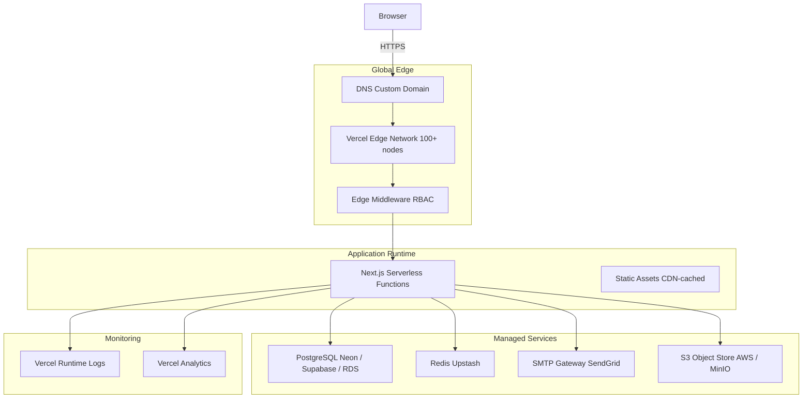

### Infrastructure Components

| Component | Recommended Service | Responsibility |
|---|---|---|
| Compute | Vercel Serverless | Next.js application runtime |
| CDN | Vercel Edge Network | Static asset delivery and edge middleware |
| Database | Neon / Supabase / AWS RDS | PostgreSQL relational data |
| Cache | Upstash Redis | Session cache and rate limiting |
| Email | SendGrid / SMTP | Transactional email delivery |
| Object Storage | AWS S3 / MinIO | File uploads (profiles, resumes, documents) |
| DNS | Vercel DNS / Cloudflare | Domain and SSL management |

---

## 25. CI/CD Strategy

```mermaid
flowchart LR
    Dev["Developer Pushes to Feature Branch"] --> PR["Pull Request Created"]
    PR --> Lint["Run ESLint"]
    Lint --> TypeCheck["TypeScript Check"]
    TypeCheck --> Build["Next.js Build Attempt"]
    Build --> Preview["Vercel Preview Deployment"]
    Preview --> Review["Code Review on Preview URL"]
    Review --> Merge["Merge to Main"]
    Merge --> ProdDeploy["Vercel Production Deployment"]
    ProdDeploy --> Migrations["Apply DB Migrations"]
    Migrations --> Smoke["Smoke Test Critical Paths"]
    Smoke --> Live["Production Live"]
```

### Deployment Steps

1. **Repository Connection:** Link GitHub repository to Vercel project workspace
2. **Environment Configuration:** Set all required environment variables in Vercel dashboard
3. **Build Configuration:** Vercel auto-detects Next.js; default commands apply
   - Install: `npm install`
   - Build: `npm run build` (next build)
   - Output: `next start` (serverless functions)
4. **Branch Strategy:** `main` for production, feature branches for preview deployments
5. **Post-Deployment:** Execute pending database migrations and seed scripts
6. **Edge Constraints:** Middleware bundle size must remain under 1MB Vercel Edge limit

### Commit Convention

| Prefix | Usage |
|---|---|
| `feat:` | New feature or capability |
| `fix:` | Bug fix |
| `chore:` | Build, config, or dependency changes |
| `refactor:` | Code restructuring without behavior change |
| `docs:` | Documentation updates |
| `test:` | Test additions or modifications |
| `style:` | CSS and visual changes |

---

## 26. Environment Configuration

| Variable | Required | Purpose |
|---|---|---|
| `DATABASE_URL` | YES | PostgreSQL primary connection string |
| `NEXT_PUBLIC_APP_URL` | YES | Base URL for email links and redirects |
| `SMTP_HOST` | YES (for email) | SMTP gateway hostname |
| `SMTP_USER` | YES (for email) | SMTP authentication username |
| `SMTP_PASS` | YES (for email) | SMTP authentication password |
| `SMTP_FROM_NAME` | YES (for email) | Display name in email From field |
| `SMTP_ADMIN_EMAIL` | YES (for email) | Admin notification recipient |
| `REDIS_URL` | Optional | Redis for session cache and rate limiting |
| `AWS_S3_BUCKET` | Optional | Object storage for file uploads |
| `NEXTAUTH_SECRET` | Recommended | Cryptographic entropy for security operations |

---

## 27. Testing Strategy and Quality Assurance

### Testing Layers

| Layer | Framework | Scope |
|---|---|---|
| Unit Testing | Vitest / Jest | Utility functions in `/lib` |
| Integration Testing | Jest + test DB | Route Handlers against test PostgreSQL |
| End-to-End Testing | Playwright | Full user flows |
| Type Checking | TypeScript Compiler | Static analysis of entire codebase |

### Test Commands

```bash
npm run test           # Run unit test suite
npm run test:e2e       # Launch Playwright E2E tests
npm run type-check     # TypeScript compilation check
npm run lint           # ESLint code quality analysis
npm run build          # Validate production build compiles
```

### Critical E2E Test Scenarios

| Flow | Steps Covered |
|---|---|
| Registration | Fill form, submit, receive confirmation email |
| Login — Normal | Enter credentials, set role cookie, redirect to dashboard |
| Login — First Login | Enter credentials, redirect to set-password, new password, dashboard |
| Login — Admin | Enter admin credentials, redirect to /admin/overview |
| Mentorship Request | Browse mentors, select, request, status shows Pending |
| Job Application | Browse jobs, apply, pipeline shows Applied |
| Scholarship Application | Browse scholarships, apply, status shows Pending |
| Admin Member Approval | Admin approves, member receives credentials email |
| Password Reset | Request reset OTP, enter OTP, set new password |
| Session Revocation | View active sessions, revoke one, session invalidated |

### Quality Standards

| Standard | Policy |
|---|---|
| TypeScript | Strict mode enabled; no `any` types in production paths |
| ESLint | All rules enforced; CI fails on lint errors |
| Build Validation | Production build must succeed before merge to main |
| Dependency Audit | `npm audit` run on each dependency update |

---

## 28. Engineering Standards

### Code Organization Principles

**Service Layer Isolation:** All database access and business logic is encapsulated in `/lib` service modules. Route Handlers call service functions without containing raw SQL or business logic.

**Component Reusability:** UI components in `/app/components/` are designed to be context-agnostic.

**Minimal External Dependencies:** Production dependencies list contains only 5 packages: `next`, `react`, `react-dom`, `lucide-react`, `nodemailer`, and `pg`.

**Mobile-First Development:** All UI development follows strict mobile-first priority.

### Design System Standards

- **Color Usage:** Raw hex values are never used in component code. All colors reference CSS custom properties
- **Icon Library:** All icons come exclusively from `lucide-react`
- **Spacing and Layout:** Consistent spacing through Tailwind's scale system; no inline style values

---

## 29. Monitoring and Observability

### Current Monitoring Capabilities

| Layer | Implementation |
|---|---|
| Application Logs | Vercel Runtime Logs (real-time, per-function) |
| Visitor Analytics | Unique visitor counter with persistence |
| Error Logging | `console.error()` with structured context throughout service layer |
| Safe Query Pattern | `safeQuery()` wrapper returns empty arrays on failure |
| Build Monitoring | Vercel deployment status and build logs |

### Planned Observability Enhancements

| Enhancement | Tool | Purpose |
|---|---|---|
| Error Tracking | Sentry | Automatic exception capture with stack traces |
| Performance Monitoring | Vercel Speed Insights | Core Web Vitals tracking |
| Database Monitoring | Neon / Supabase built-in metrics | Query performance, connection counts |
| Uptime Monitoring | UptimeRobot / Betterstack | Availability alerts |
| Audit Logging | Custom audit table | Admin action trail for compliance |

---

## 30. Email Communication System

The platform includes a comprehensive, branded email communication system supporting 11 distinct workflow notifications. All emails are rendered with a consistent visual identity using the platform's brand colors.

### Email Templates Inventory

| Template | Trigger | Recipients |
|---|---|---|
| OTP Verification | Email verification during registration | Registrant |
| OTP Password Reset | Forgot password request | Account holder |
| Registration Confirmation | Successful registration submission | Registrant |
| Registration Admin Notification | New registration received | Admin email |
| Member Status Update (Approved) | Member approved | Member |
| Member Status Update (Rejected) | Member rejected | Member |
| Member Status Update (Needs Info) | More info requested | Member |
| Member Approved with Credentials | Account created | New member |
| Password Changed Confirmation | Successful password update | Account holder |
| Request Status Update | Support ticket status changed | Ticket submitter |
| Mentor Assignment Notification | Mentee assigned to mentor | Mentor |
| Contact Form Auto-Reply | Support form submitted | Form submitter |
| Contact Form Admin Notification | Support form received | Admin email |

### Email Design System

All emails use a shared HTML wrapper template with:

- Brand header with institution name and gradient background in Royal Blue (#1E348A) and Deep Blue (#1F2957)
- Content area with consistent typography and spacing
- Contextual status cards (green for success, red for rejection, yellow for warning/info)
- Call-to-action buttons linking to relevant portal sections
- Footer with copyright and "do not reply" notice

### Mentor Assignment Email (Feature Highlight)

When a mentee is assigned to a mentor, the system sends the mentor a rich email containing:
- Mentee's full name, email, and phone number
- Career track, stage, and urgency level (color-coded for high urgency)
- Mentee's stated goal
- Next steps guidance (reach out within 48 hours)
- Direct link to Mentor Dashboard

This automated, information-rich email enables immediate, actionable mentorship engagement without requiring the mentor to log in to retrieve mentee details.

---

## 31. Business Value and Institutional Benefits

### Quantifiable Benefits

| Benefit | Before Platform | After Platform |
|---|---|---|
| Member Registration | Days (manual email review) | Hours (structured queue with automation) |
| Alumni Directory | Unavailable or outdated Excel | Real-time, searchable, always current |
| Job Posting Reach | WhatsApp group of ~50 people | Entire verified alumni community |
| Scholarship Applications | Paper forms with manual tracking | Digital with automated status updates |
| Mentorship Connections | Informal, personal contacts only | Structured, discoverable, 48h response expectation |
| Admin Communication Time | 10+ hours/week | Under 2 hours/week (automated emails) |
| Community Visibility | Zero analytics | Real-time dashboard with 6-month trends |

### Institutional Value Propositions

**For Educational Institutions:**
- A professional digital presence for alumni engagement
- Structured scholarship administration reducing disbursement errors
- Career placement support through job board and mentorship
- Data-driven community insights for fundraising and programming

**For Alumni:**
- Professional profile in an institutional directory
- Access to exclusive job opportunities from the alumni network
- Mentorship from experienced seniors in their field
- Scholarship opportunities with transparent application processes

**For Administrators:**
- Single dashboard for all community operations
- Automated email workflows eliminating repetitive communication tasks
- Priority-based support ticket management
- Real-time analytics for informed decision-making

---

## 32. Reusability and Customization

### Architecture for Reuse

| Customization Point | Implementation |
|---|---|
| Institution Name | `BRAND.portalName` constant (propagates to all emails) |
| Portal URL | `NEXT_PUBLIC_APP_URL` environment variable |
| Brand Colors | CSS custom properties in `globals.css` |
| Email Sender | `SMTP_FROM_NAME` and `SMTP_FROM_EMAIL` environment variables |
| Admin Email | `SMTP_ADMIN_EMAIL` environment variable |
| Database | Standard PostgreSQL connection string |

### Deployment Scenarios

| Institution | Adaptation Required | Effort |
|---|---|---|
| Another JNV school | Change branding, deploy same codebase | Under 1 day |
| Engineering college | Add department field to profile, update branding | 1–2 days |
| University | Add faculty role, department isolation | 3–5 days |
| NGO | Replace house/batch with membership tier | 2–3 days |
| Professional Association | Add credential verification, certification tracking | 3–5 days |

### Modular Isolation

Each major module (Jobs, Scholarships, Events, Mentorship, Members) is isolated with independent database tables, separate service files in `/lib` with no circular imports, independent API namespaces, and independent UI modules. A deployment for a smaller institution can activate only the modules it needs by removing the corresponding routes and navigation items.

---

## 33. Product Differentiators

### What Sets This Platform Apart

**1. Zero-Configuration Database**
Tables are automatically created and indexed on first request. No separate migration script is required for initial deployment. Development seeding is automatic, making onboarding new contributors frictionless.

**2. Edge-Level Security**
Role-based access control runs at the Vercel Edge — geographically closest to the user — before any request hits the application server.

**3. Production-Grade Email System**
11 distinct, visually branded HTML email templates cover every major workflow interaction. Most comparable open-source tools offer simple text emails or no email integration.

**4. Dual Profile Architecture**
The user profile system supports two fundamentally different profile types — Students and Employed Alumni — with completely different field sets, under a single unified account model.

**5. Application-Level Caching**
Multiple service modules implement in-memory result caching with short TTLs, preventing unnecessary database hits without requiring Redis for basic operation.

**6. Rich Mentor Assignment Notification**
When a mentee is assigned to a mentor, the system sends the mentor a rich email containing the mentee's complete profile, goals, urgency level, and direct contact information — enabling immediate mentorship engagement.

**7. Fully Responsive, Mobile-First Design**
The admin and user sidebars implement mobile overlay patterns, collapsible desktop states, and responsive breakpoints — resulting in a professional experience across all device sizes.

**8. Bilateral Block Enforcement**
The user blocking system checks both directions (A blocks B OR B blocks A) preventing messaging in either direction without requiring two separate database entries.

---

## 34. Challenges and Solutions

| Challenge | Description | Solution Applied |
|---|---|---|
| Serverless Connection Exhaustion | Multiple function instances each opening new DB connections | Singleton pool pattern on `globalThis`; bounded `max: 5` pool |
| First-Login Security | Admin-created accounts need forced password change | `pending_first_login` flag with server-side gate at login API |
| RBAC at Edge | Route protection must run before server computation | Next.js Edge Middleware reading cookies at Vercel Edge |
| Auto-Table Provisioning | Database must initialize without manual migration | `ensureTable()` pattern with idempotent `CREATE TABLE IF NOT EXISTS` |
| Username Uniqueness | Short usernames must not collide | Retry loop with 10 attempts using `crypto.randomBytes` suffix |
| Dual Profile Types | Students and employed alumni need different field sets | `profile_type` discriminator with conditional form sections |
| Analytics Query Cost | Multiple aggregation queries expensive per page load | In-memory cache with 15-second TTL via `Promise.all()` parallel execution |
| Email Deliverability | Automated emails potentially flagged as spam | SMTP configuration with proper `From` headers and SPF/DKIM via SendGrid |
| Bilateral Block Enforcement | User blocks must prevent messaging in both directions | `isBlocked()` function checks both (A blocks B) OR (B blocks A) |

---

## 35. Current Limitations

| Limitation | Description | Planned Resolution |
|---|---|---|
| Single Admin Role | No admin hierarchy or department-level admin scoping | Multi-level admin roles in v2.0 |
| No Real-Time Notifications | No push notifications for messages or mentorship updates | WebSocket or Server-Sent Events integration |
| No File Upload | Profile pictures and resume uploads not yet implemented | S3 integration planned |
| No Search in Messages | Messages cannot be searched by content | Full-text search with PostgreSQL `tsvector` |
| No Message Pagination | All messages loaded for a conversation | Cursor-based pagination |
| In-Memory Cache | Analytics cache resets on serverless function cold start | Redis integration for persistent cache |
| No Audit Log | Admin actions not recorded in a permanent trail | Audit table in v2.0 |
| Single Tenant | One institution per deployment | Multi-tenancy organization model in roadmap |
| No Mobile App | Web-only platform | React Native / PWA in roadmap |

---

## 36. Future Roadmap

### Short-Term (v1.6 — v1.8)

| Feature | Description |
|---|---|
| S3 File Uploads | Profile picture and resume upload with S3 storage |
| Audit Logging | Admin action trail with timestamp, action, and affected record |
| Redis Session Cache | Replace in-memory caches with persistent Redis |
| Enhanced Search | Full-text search in directory, jobs, and events |
| Email Queue | Async email delivery with retry logic |

### Medium-Term (v2.0)

| Feature | Description |
|---|---|
| Multi-Level Admin | Department admins, super admins, read-only admins |
| Real-Time Notifications | WebSocket-based push notifications for messages and mentorship |
| Mobile PWA | Progressive Web App with offline support and push notifications |
| Payment Gateway | Online scholarship donations and fee collection |
| Advanced Analytics | Retention curves, cohort analysis, engagement scoring |
| API Documentation | Auto-generated OpenAPI / Swagger specification |

### Long-Term Vision (v3.0+)

| Feature | Description |
|---|---|
| AI-Powered Mentorship Matching | Machine learning model matching mentees to mentors based on goals and skills |
| Multi-Institution Platform | SaaS multi-tenancy supporting multiple schools on one deployment |
| AI Chatbot | Institution-specific AI assistant for alumni queries |
| Mobile Application | Native iOS and Android application |
| Video Mentorship | Integrated video sessions within the mentorship module |
| Blockchain Certificates | Verifiable credential issuance for alumni achievements |
| Fundraising Module | Comprehensive donor management and campaign tracking |
| Event Ticketing | Paid event registration with QR code check-in |

---

## 37. Conclusion

The JNV Alumni Portal represents a significant step forward in how educational institutions can engage, serve, and empower their alumni communities. Built with modern engineering practices, enterprise-grade security, and a modular architecture designed for longevity and reuse, the platform delivers capabilities that were previously accessible only to large, well-funded institutions through expensive commercial software.

### What Has Been Achieved

The platform successfully delivers:

- A complete, production-deployable alumni management system built on Next.js 16 and PostgreSQL
- Secure, role-based access with edge-level enforcement through `proxy.ts` middleware
- 11 automated email workflow templates with professional branded HTML design
- A comprehensive job board, mentorship system, and scholarship administration module
- Real-time analytics with in-memory caching across 13+ database tables
- A dual-profile architecture supporting both student and employed alumni
- Full session management including 2FA, session tracking, and bilateral user blocking
- A responsive, mobile-first design with collapsible sidebar navigation for both admin and user workspaces

### Strategic Significance

The platform is not a one-institution solution. Its modular, environment-driven architecture allows it to be deployed for any school, college, university, NGO, or professional community with minimal configuration. There are 649 Jawahar Navodaya Vidyalayas in India alone — each representing a potential deployment. Nationally and globally, the addressable need for a deployable, production-grade alumni management platform is significant.

### The Path Forward

With the foundation firmly established, the roadmap toward real-time notifications, AI-powered mentorship matching, mobile application delivery, and multi-institution SaaS deployment represents a clear and credible product evolution path. The architecture decisions made today — modular service isolation, environment-driven configuration, auto-provisioning database tables — position the platform well for these enhancements.

The JNV Alumni Portal demonstrates that a focused engineering team can build and deliver enterprise-quality software that matches — and in several dimensions exceeds — the capabilities of commercially licensed alumni management systems costing orders of magnitude more.

---

## 38. Appendix

### A. Admin Navigation Structure

| Menu Item | Route | Icon | Function |
|---|---|---|---|
| Overview | /admin/overview | LayoutDashboard | Dashboard KPIs |
| Members | /admin/members | Users | Registration queue |
| Requests | /admin/requests | Inbox | Support tickets |
| Mentorship | /admin/mentorship | BookOpen | Mentorship administration |
| Events | /admin/events | Calendar | Event management |
| Scholarships | /admin/scholarships | CreditCard | Scholarship administration |
| Website | /admin/web | Globe2 | Content management |
| Analytics | /admin/analytics | BarChart3 | Data analytics |
| Settings | /admin/settings | Settings | Platform configuration |

### B. User Navigation Structure

| Menu Item | Route | Icon | Visibility |
|---|---|---|---|
| Overview | /user | LayoutDashboard | All users |
| My Profile | /user/profile | User | All users |
| My Network | /user/network | Users | All users |
| Mentorship | /user/mentorship | Compass | All users |
| Mentor Dashboard | /user/mentor | ShieldCheck | Mentors only (conditional) |
| Jobs | /user/jobs | Briefcase | All users |
| Events | /user/events | BookOpen | All users |
| Scholarships | /user/scholarships | Award | All users |
| Messages | /user/messages | MessageSquare | All users |
| Settings | /user/settings | Settings | All users |

### C. Scholarship Application Status Lifecycle

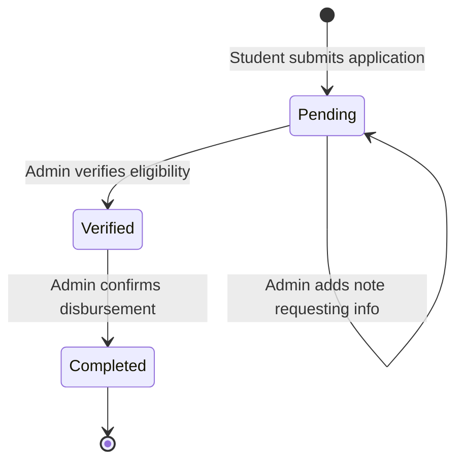

### D. Member Registration Status Lifecycle

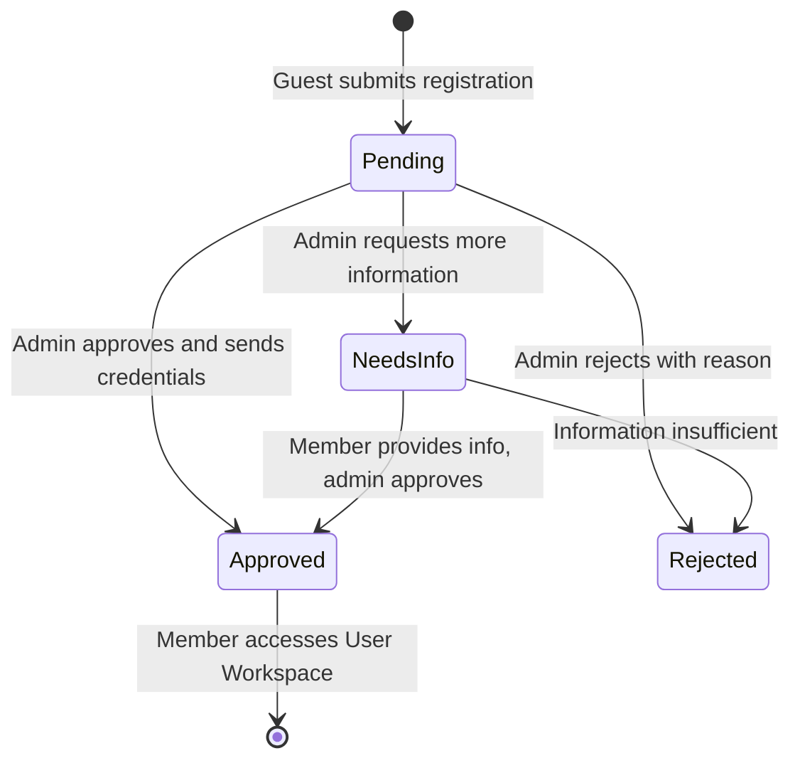

### E. Job Application Pipeline

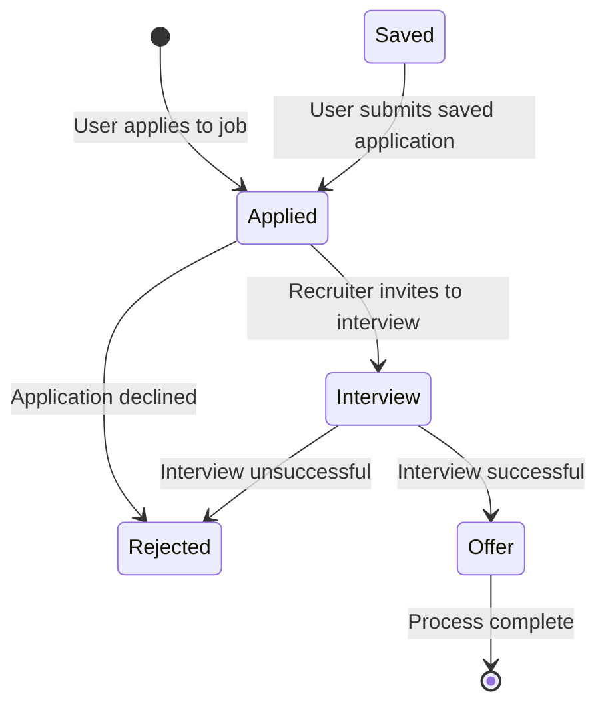

### F. Mentorship Request Lifecycle

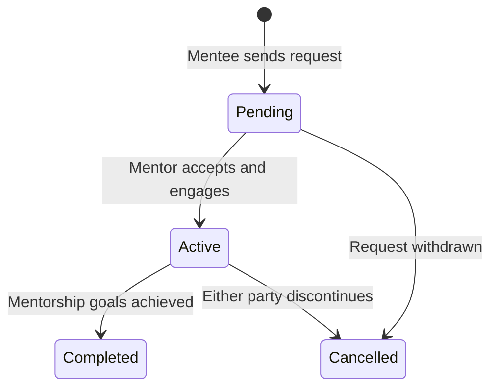

---

## 39. Glossary

| Term | Definition |
|---|---|
| App Router | Next.js routing architecture under `/app` where all components are React Server Components by default |
| Auth Cookie | HTTP cookie carrying authentication state (auth_user, auth_role, auth_email) |
| BIGSERIAL | PostgreSQL auto-incrementing integer primary key type |
| Cascade Delete | Database constraint that automatically deletes child records when parent is deleted |
| CDN | Content Delivery Network; geographically distributed server network for fast asset delivery |
| Connection Pool | Collection of reusable database connections managed by the `pg` library |
| CSP | Content Security Policy; HTTP header restricting permitted script and resource sources |
| Disbursement | The financial act of transferring approved scholarship funds to a beneficiary |
| Edge Middleware | Security and routing logic executed at the CDN edge, geographically closest to the user |
| First-Login Gate | Forced password change flow triggered when `pending_first_login = true` for a new account |
| HttpOnly Cookie | A browser cookie inaccessible to JavaScript, protecting against XSS token theft |
| Multi-Tenancy | Serving multiple organizations from a single application deployment with data isolation |
| OTP | One-Time Password; a time-limited code for authentication verification |
| Parameterized Query | SQL query using placeholders instead of string interpolation, preventing SQL injection |
| RBAC | Role-Based Access Control; restricting system access based on assigned user roles |
| React Server Component | A React component rendered on the server with direct data access, without client-side JavaScript |
| Route Handler | A Next.js serverless function handling HTTP requests at a specific API route path |
| SameSite | Cookie attribute controlling cross-site request behavior (Lax prevents most CSRF attacks) |
| Serverless | Cloud execution model where functions run on demand without persistent server management |
| Session Token | A 256-bit random string identifying an authenticated user session, stored in database |
| SMTP | Simple Mail Transfer Protocol; the standard protocol for sending email |
| Strict TypeScript | TypeScript mode with maximum type checking enabled (strict: true in tsconfig.json) |
| Tailwind CSS | A utility-first CSS framework generating minimal CSS based on used classes |
| TIMESTAMPTZ | PostgreSQL timestamp type including timezone information, stored in UTC |
| TTL | Time-to-Live; the duration for which a cached result is considered valid |
| Vercel Edge Network | Vercel's global CDN infrastructure running edge functions at 100+ global locations |
| Zod | A TypeScript-first schema validation library used for API input validation |
| 2FA | Two-Factor Authentication; an additional verification step beyond password |
| 3NF | Third Normal Form; a database design standard minimizing redundancy and ensuring integrity |

---

*Document End*

---

**Maintained by the Alumni Tech Team**
**System Version 1.5.0 | Report Date: June 2026**
**Classification: Confidential — Stakeholder Distribution Only**

*For deployment inquiries, technical partnerships, or institutional licensing discussions, contact the development team through the portal's official channels.*

