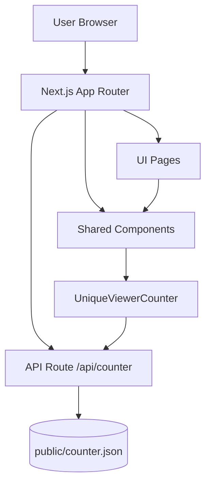
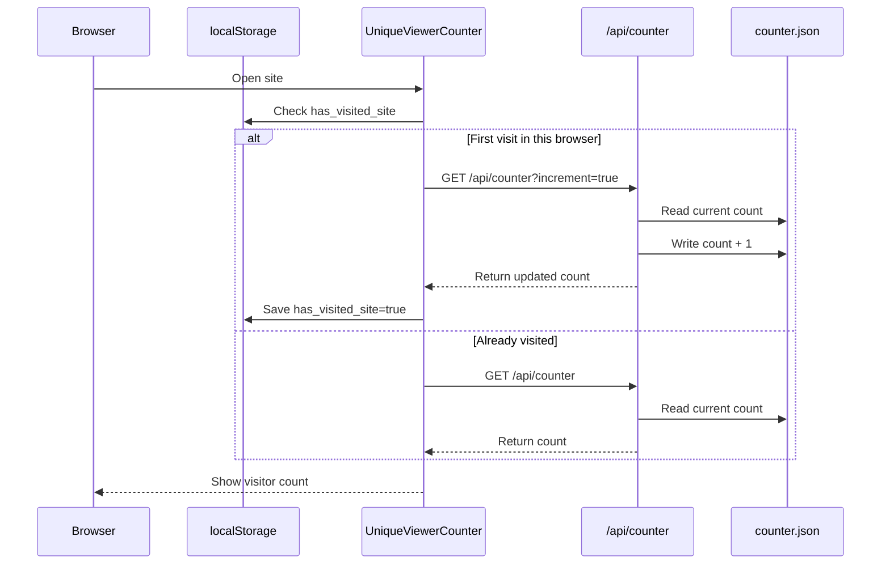

# Alumni Portal

Alumni Portal is a community platform for JNV Farrukhabad alumni.
It helps alumni reconnect, share opportunities, join events, and support mentorship initiatives.

This documentation explains what is implemented now, what technologies are used, and what is planned next.

## 1. Project Goals

The main goals of this project are:

- Build a central digital platform for alumni.
- Make it easy to discover people, jobs, events, and mentorship programs.
- Keep the UI clean, fast, and mobile-friendly.
- Follow a consistent design system and code quality standards.

## 2. Current Status

### Fully Implemented

- Homepage with highlights, impact metrics, testimonials, and call-to-action sections.
- About page with mission, values, milestones, and committee information.
- Alumni Directory page with complete listing layout and filter/search interface structure.
- Events page with featured events, timeline roadmap, and support callout.
- Jobs page with featured opportunities and hiring-oriented sections.
- Mentorship page with mentorship tracks, process flow, and request form UI.
- Registration page with complete multi-field alumni registration form UI.
- Contact page with support channels, response-time section, and support request form UI.
- Legal pages: Privacy Policy and Terms of Service.
- Team page.
- Shared layout components: navbar, footer, and unique viewer counter.
- API route for unique visitor count.

### Partially Implemented

- Forms and filters are UI-first and not yet connected to a persistent backend.

### Implemented Dashboard Modules

- Role-based login with user and admin dashboards.
- Admin dashboard with overview and all operational tabs:
  - members, programs, events, requests, finance, analytics, security, settings
- User dashboard with profile, scholarships, jobs, mentorship, network, events, messages, and settings.

## 3. Tech Stack (What We Are Using)

### Core Framework

- Next.js 16 (App Router)
- React 19
- TypeScript 5

### Styling and UI

- Tailwind CSS v4
- CSS variables-based design tokens defined in global styles
- Lucide React for icons

### Quality and Tooling

- ESLint 9
- eslint-config-next

### Runtime and Package Management

- Node.js 20+ (recommended)
- npm (default package manager)

## 4. Folder Structure

```text
app/
  about/
  api/
    counter/
      route.ts
  components/
    Footer.tsx
    Navbar.tsx
    UnderConstruction.tsx
    UniqueViewerCounter.tsx
  contact/
  demo/
  directory/
  donate/
  events/
  jobs/
  login/
  mentorship/
  news/
  privacy/
  register/
  share-story/
  team/
  terms/
  globals.css
  layout.tsx
  page.tsx
public/
  counter.json
```

## 5. Route Map

| Route | Purpose | Status |
|---|---|---|
| / | Home | Implemented |
| /about | About community and leadership | Implemented |
| /directory | Alumni directory UI | Implemented |
| /events | Events and reunions | Implemented |
| /jobs | Career opportunities | Implemented |
| /mentorship | Mentorship journeys and form UI | Implemented |
| /register | Alumni registration form UI | Implemented |
| /contact | Support/help request UI | Implemented |
| /privacy | Privacy policy | Implemented |
| /terms | Terms of service | Implemented |
| /team | Team showcase | Implemented |
| /login | Role-based login flow | Implemented |
| /demo | Theme and style demo | Implemented |
| /donate | Donation page | Implemented |
| /news | Community news page | Implemented |
| /share-story | Story sharing page | Implemented |
| /api/counter | Unique visitor counter API | Implemented |

## 6A. Login Guide and Demo Credentials

Use these credentials on the login page:

- Admin Login
  - Email: `admin@jnvportal.in`
  - Password: `Admin@123`
- User Login
  - Email: `alumni@jnvportal.in`
  - Password: `User@123`
- Both-access Demo (choose role after login)
  - Email: `access@jnvportal.in`
  - Password: `Portal@123`

How admin login works:

1. Open `/login`.
2. Enter admin credentials.
3. After successful validation, system sets auth cookies and redirects to `/admin`.
4. Protected routing (`/admin` and `/user`) is controlled by `proxy.ts`.

## 6. Design System

The project follows a strict theme-token approach from global CSS.
Hardcoded random color values should be avoided in component styles.

### Theme Tokens

| Token | Light | Dark | Purpose |
|---|---|---|---|
| --color-primary | #1E348A | #60A5FA | Main actions and highlights |
| --color-secondary | #C9A227 | #FBBF24 | Secondary emphasis |
| --color-accent | #93C5FD | #38BDF8 | Accent surfaces |
| --color-bg | #F8F9F4 | #0F172A | App background |
| --color-card | #FFFFFF | #1E293B | Card backgrounds |
| --color-text-primary | #1F2957 | #F1F5F9 | Primary text |
| --color-text-secondary | #1E348A | #94A3B8 | Secondary text |
| --color-border | #CBD5E1 | #334155 | Borders and separators |

### Theme Behavior

- Theme toggle is available in the navbar.
- User preference is stored in localStorage with key `theme`.
- Dark mode is enabled by toggling the `dark` class on the root HTML element.

## 7. Shared Components

- `Navbar`: sticky top navigation, responsive mobile menu, light/dark switch.
- `Footer`: quick links, contact blocks, legal links, and viewer counter section.
- `UnderConstruction`: reusable placeholder for unfinished pages.
- `UniqueViewerCounter`: fetches visitor count and increments once per browser.

## 8. API Documentation

### GET /api/counter

Returns unique visitor count.

#### Query Parameters

- `increment=true`: increment count before returning response.

#### Response

```json
{
  "count": 1241
}
```

#### Implementation Notes

- Counter storage file: `public/counter.json`
- Initializes with base value `1240` if file is missing.
- Frontend uses localStorage key `has_visited_site` to avoid repeated increments from same browser.

## 9. System Diagrams

This section gives a visual view of how the app is organized and how key requests move through the system.

### High-Level Architecture



What this diagram shows:

- Users open pages in the browser.
- Next.js App Router serves pages and shared components.
- Footer component uses `UniqueViewerCounter`.
- Counter component calls `/api/counter`.
- API reads/writes `public/counter.json`.

### Unique Visitor Counter Flow



Why this flow is useful:

- Avoids repeated increments from the same browser.
- Keeps API logic simple and transparent.
- Stores count in a lightweight JSON file for now.

## 10. Development Setup

### Prerequisites

- Node.js 20+
- npm

### Install Dependencies

```bash
npm install
```

### Run Development Server

```bash
npm run dev
```

Application URL:

`http://localhost:3000`

### Production Build

```bash
npm run build
npm run start
```

### Lint

```bash
npm run lint
```

## 11. Scripts

| Script | Command | Description |
|---|---|---|
| dev | `next dev` | Start development server |
| build | `next build` | Create production build |
| start | `next start` | Run production server |
| lint | `eslint` | Run static lint checks |

## 12. Engineering Standards

Project standards are maintained through `project_rules.md`.

Key rules:

- Use only project theme variables for colors.
- Keep dependency count minimal.
- Use only `lucide-react` for icons.
- Prioritize performance and avoid unnecessary UI bloat.
- Build mobile-first and then scale to tablet/desktop.

## 13. Known Limitations

- Most forms are currently presentational and not connected to persistent backend services.
- Authentication and login logic are not fully implemented yet.
- Search and filter controls are UI-ready but data logic is pending.

## 14. Future Roadmap (What We Will Use Next)

The following items are planned for upcoming phases.

### Backend and Data

- Add server-side API integration for registration, mentorship, contact, and other forms.
- Introduce database storage for users, profiles, jobs, events, and mentorship records.
- Add admin-level moderation and verification flows.

### Authentication and Security

- Implement secure authentication flow for alumni accounts.
- Add role-based access for user/admin/moderator actions.
- Improve request validation, error handling, and audit-safe operations.

### Product Features

- Add real search/filter logic for directory and jobs.
- Add profile management dashboard for alumni.
- Add content management workflows for events/news/stories.

### Quality and Operations

- Add test coverage for critical journeys.
- Add CI checks for lint/build/test before deployment.
- Add monitoring and error tracking for production stability.

## 15. Recommended Next Implementation Order

1. Connect forms to backend APIs and database.
2. Build authentication and protected profile routes.
3. Implement real search/filter on jobs and directory.
4. Add admin dashboard for content and member verification.
5. Add test suite and CI pipeline.

## 16. Deployment

This project is compatible with Vercel and other Node.js hosting providers that support Next.js App Router.

### Vercel Deployment Flow

1. Import repository in Vercel.
2. Install dependencies automatically.
3. Build command: `npm run build`
4. Start command: `npm run start`

## 17. Maintainers

Designed and developed by the Alumni Tech Team.