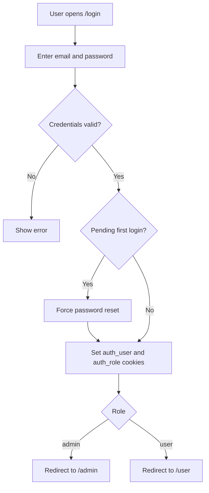
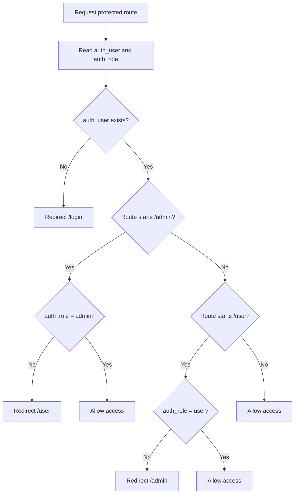
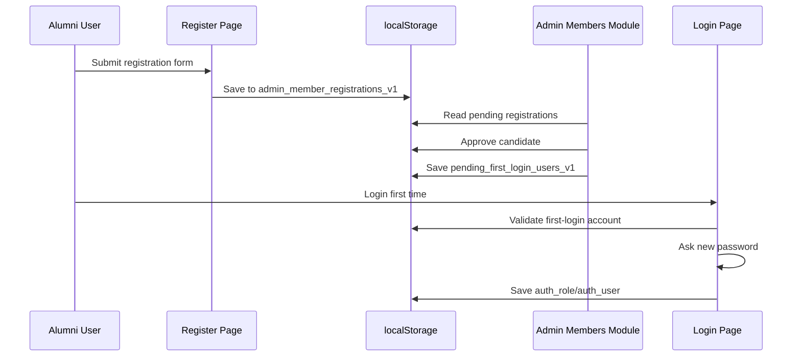
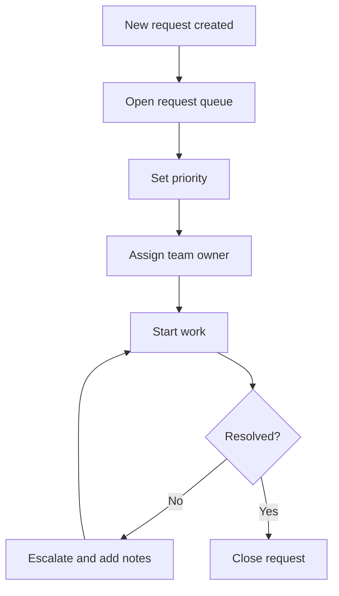
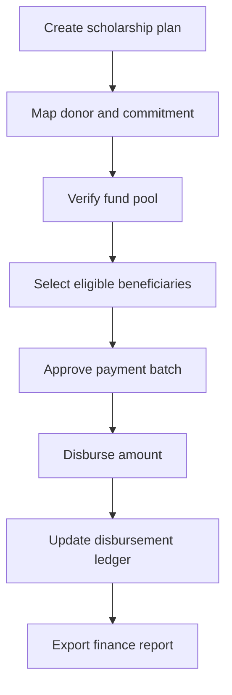
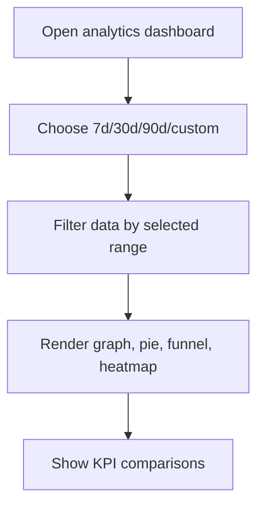

# Alumni Portal

Alumni Portal is a role-based platform for alumni community operations.
It combines a public website, admin workspace, and user workspace in one Next.js application.

This README is fully detailed and includes:

- Current implementation details
- Backend information (current and target architecture)
- ER diagram
- Multiple flow diagrams
- Clean tables for routes, modules, data entities, and APIs

## 1. Product Overview

| Area | Description | Current Status |
|---|---|---|
| Public Website | Public pages for alumni engagement, events, opportunities, and communication | Implemented |
| Authentication | Role-based login (admin/user), first-login setup support | Implemented (frontend + cookies) |
| Admin Workspace | Members, requests, scholarships, analytics, settings workflows | Implemented (frontend workflows) |
| User Workspace | Profile, network, mentorship, jobs, events, scholarships, messages, settings | Implemented |
| Backend APIs | Functional APIs for core modules | Partially implemented (only visitor counter route is live) |

## 2. Technology Stack

| Layer | Technology |
|---|---|
| Framework | Next.js 16.1.1 (App Router) |
| UI | React 19.2.3 |
| Language | TypeScript 5 |
| Styling | Tailwind CSS v4 |
| Icons | lucide-react |
| Linting | ESLint 9 + eslint-config-next |

## 3. Project Structure

```text
app/
  admin/
    [id]/page.tsx
    layout.tsx
    page.tsx
    settings/
      page.tsx
      AdminSettingsPanel.tsx
  user/
    [id]/page.tsx
    layout.tsx
    page.tsx
    settings/
      page.tsx
      UserSettingsPanel.tsx
  api/
    counter/
      route.ts
  components/
    Footer.tsx
    Navbar.tsx
    UnderConstruction.tsx
    UniqueViewerCounter.tsx
  login/page.tsx
  register/page.tsx
  scholarships/page.tsx
  schoolership/page.tsx
  settings/page.tsx
proxy.ts
public/
  counter.json
```

## 4. Architecture

### 4.1 Current System Architecture

```mermaid
flowchart LR
  Browser[Browser] --> NextApp[Next.js App Router]
  NextApp --> PublicUI[Public Pages]
  NextApp --> AuthUI[Login and Register]
  AuthUI --> Guard[proxy.ts Middleware Guard]
  Guard --> AdminUI[Admin Dashboard]
  Guard --> UserUI[User Dashboard]
  NextApp --> CounterAPI[/api/counter]
  CounterAPI --> FileStore[(public/counter.json)]
  AdminUI --> LocalStore[(localStorage)]
  UserUI --> LocalStore
```

### 4.2 Component Responsibility Table

| Component | Responsibility | Data Source |
|---|---|---|
| Public Pages (`app/*`) | Informational content and community landing pages | Static/UI data |
| `app/login/page.tsx` | Credential checks, role routing, first-login handling | Cookies + localStorage |
| `app/register/page.tsx` | New member registration flow | localStorage |
| `proxy.ts` | Route protection and role-based redirect enforcement | Cookies (`auth_user`, `auth_role`) |
| `app/admin/[id]/page.tsx` | Dynamic admin module rendering and module workflows | localStorage + component state |
| `app/admin/settings/AdminSettingsPanel.tsx` | Admin platform controls and governance settings | localStorage (`admin_settings_v1`) |
| `app/user/[id]/page.tsx` | Dynamic user module pages | Component state |
| `app/api/counter/route.ts` | Visitor count read/write endpoint | `public/counter.json` |

## 5. Backend Information

### 5.1 Current Backend (Implemented)

| Backend Capability | Implementation | Notes |
|---|---|---|
| Route middleware/guard | `proxy.ts` | Role-based protection is active |
| Counter API | `GET /api/counter` | Only fully implemented backend route |
| Auth storage | Cookies + localStorage | Demo-safe flow, not production auth |
| Workflow persistence | localStorage keys | Used for approvals/settings simulation |

### 5.2 Target Backend Architecture (Recommended)

| Layer | Suggested Technology | Purpose |
|---|---|---|
| API Layer | Next.js Route Handlers or Node service | Secure business APIs for members, requests, scholarships |
| Auth Layer | JWT/Session + refresh strategy | Production-grade authentication and role claims |
| Database Layer | PostgreSQL (recommended) | Durable relational data for workflows |
| Cache Layer | Redis (optional) | Session/cache/rate-limiting support |
| Queue Layer | BullMQ/SQS (optional) | Async notifications and report jobs |
| File Storage | S3-compatible storage (optional) | Documents, profile assets, exports |
| Monitoring | OpenTelemetry + logging stack | API and workflow observability |

### 5.3 Backend Modules and Responsibilities

| Module | Core Responsibilities | Suggested Tables |
|---|---|---|
| Auth | Login, role sessions, first-login reset | users, sessions, password_resets |
| Member Registry | Registration intake, approval/rejection, profile activation | registrations, users, alumni_profiles |
| Request Queue | Ticket lifecycle, assignment, escalation | support_requests, request_comments |
| Scholarship Engine | Program creation, donor mapping, disbursal tracking | scholarships, donors, donor_commitments, disbursements |
| Analytics | Aggregations and dashboard metrics | analytics_snapshots, event_logs |
| Settings | Platform-level controls and feature flags | admin_settings, feature_flags |

## 6. Database Design (ER + Data Dictionary)

### 6.1 ER Diagram (Target Relational Model)

```mermaid
erDiagram
  USERS ||--o{ ALUMNI_PROFILES : has
  USERS ||--o{ SESSIONS : owns
  USERS ||--o{ REGISTRATIONS : submits
  USERS ||--o{ SUPPORT_REQUESTS : raises
  USERS ||--o{ REQUEST_COMMENTS : writes
  USERS ||--o{ MENTORSHIP_REQUESTS : creates
  USERS ||--o{ EVENT_REGISTRATIONS : books
  USERS ||--o{ DISBURSEMENTS : receives

  SCHOLARSHIPS ||--o{ DISBURSEMENTS : funds
  DONORS ||--o{ DONOR_COMMITMENTS : commits
  SCHOLARSHIPS ||--o{ DONOR_COMMITMENTS : mapped_to

  EVENTS ||--o{ EVENT_REGISTRATIONS : has

  USERS {
    uuid id PK
    string email
    string role
    string status
    datetime created_at
  }

  ALUMNI_PROFILES {
    uuid id PK
    uuid user_id FK
    string full_name
    string batch
    string profession
  }

  REGISTRATIONS {
    uuid id PK
    string email
    string status
    datetime submitted_at
    datetime reviewed_at
  }

  SUPPORT_REQUESTS {
    uuid id PK
    uuid created_by FK
    string category
    string priority
    string status
    datetime created_at
  }

  REQUEST_COMMENTS {
    uuid id PK
    uuid request_id FK
    uuid author_id FK
    string message
    datetime created_at
  }

  SCHOLARSHIPS {
    uuid id PK
    string name
    decimal amount
    string cycle
    string status
  }

  DONORS {
    uuid id PK
    string donor_name
    string donor_type
  }

  DONOR_COMMITMENTS {
    uuid id PK
    uuid donor_id FK
    uuid scholarship_id FK
    decimal committed_amount
    string cycle
  }

  DISBURSEMENTS {
    uuid id PK
    uuid scholarship_id FK
    uuid beneficiary_user_id FK
    decimal amount
    string disbursal_status
    datetime disbursed_at
  }

  EVENTS {
    uuid id PK
    string title
    datetime event_date
    string status
  }

  EVENT_REGISTRATIONS {
    uuid id PK
    uuid event_id FK
    uuid user_id FK
    string attendance_status
  }

  MENTORSHIP_REQUESTS {
    uuid id PK
    uuid requester_user_id FK
    uuid mentor_user_id FK
    string status
    datetime created_at
  }

  SESSIONS {
    uuid id PK
    uuid user_id FK
    datetime issued_at
    datetime expires_at
  }
```



### 6.2 Data Dictionary Table

| Table | Primary Key | Important Foreign Keys | Main Purpose |
|---|---|---|---|
| users | id | - | Master identity, role, and account status |
| alumni_profiles | id | user_id -> users.id | Alumni personal and professional profile |
| registrations | id | optional user_id -> users.id | Registration queue before approval |
| sessions | id | user_id -> users.id | Session lifecycle and token tracking |
| support_requests | id | created_by -> users.id | Request queue items |
| request_comments | id | request_id -> support_requests.id, author_id -> users.id | Internal communication on requests |
| scholarships | id | - | Scholarship master definitions |
| donors | id | - | Donor directory |
| donor_commitments | id | donor_id -> donors.id, scholarship_id -> scholarships.id | Donor to scholarship amount mapping |
| disbursements | id | scholarship_id -> scholarships.id, beneficiary_user_id -> users.id | Scholarship payment tracking |
| events | id | - | Event records |
| event_registrations | id | event_id -> events.id, user_id -> users.id | Event participation mapping |
| mentorship_requests | id | requester_user_id -> users.id, mentor_user_id -> users.id | Mentorship request pipeline |

## 7. Routes Catalog

### 7.1 Public Routes

| Route | Access | Purpose | Status |
|---|---|---|---|
| `/` | Public | Home landing page | Active |
| `/about` | Public | About community | Active |
| `/directory` | Public | Alumni directory listing | Active |
| `/directory/[id]` | Public | Alumni profile detail page | Active |
| `/events` | Public | Events overview | Active |
| `/jobs` | Public | Jobs listing page | Active |
| `/mentorship` | Public | Mentorship information | Active |
| `/scholarships` | Public | Scholarship page | Active |
| `/schoolership` | Public | Legacy/alternate scholarship page | Active |
| `/donate` | Public | Donation page | Active |
| `/news` | Public | News page | Active |
| `/share-story` | Public | Story sharing page | Active |
| `/team` | Public | Team page | Active |
| `/contact` | Public | Contact page | Active |
| `/register` | Public | Member registration form | Active |
| `/login` | Public | Role-based login | Active |
| `/privacy` | Public | Privacy policy | Active |
| `/terms` | Public | Terms and conditions | Active |
| `/demo` | Public | Demo page | Active |
| `/settings` | Public | Root settings page | Active |

### 7.2 Admin Routes

| Route | Access | Purpose | Status |
|---|---|---|---|
| `/admin` | Admin | Dashboard overview | Active |
| `/admin/members` | Admin | Members management | Active |
| `/admin/programs` | Admin | Program operations | Active |
| `/admin/events` | Admin | Event operations | Active |
| `/admin/requests` | Admin | Request queue management | Active |
| `/admin/finance` | Admin | Scholarship operations | Active |
| `/admin/analytics` | Admin | Visual analytics board | Active |
| `/admin/settings` | Admin | Admin settings center | Active |

### 7.3 User Routes

| Route | Access | Purpose | Status |
|---|---|---|---|
| `/user` | User | User dashboard overview | Active |
| `/user/profile` | User | Profile area | Active |
| `/user/network` | User | Network area | Active |
| `/user/mentorship` | User | Mentorship area | Active |
| `/user/jobs` | User | Job area | Active |
| `/user/events` | User | User events area | Active |
| `/user/scholarships` | User | User scholarships area | Active |
| `/user/messages` | User | Messaging area | Active |
| `/user/settings` | User | User settings page | Active |

### 7.4 API Routes

| Route | Method | Purpose | Status |
|---|---|---|---|
| `/api/counter` | GET | Read count (and optional increment) | Active |

## 8. Authentication and Authorization Flows

### 8.1 Login and Guard Flow



### 8.2 Route Protection Flow



## 9. Operational Flow Diagrams

### 9.1 Registration to Approval Flow



### 9.2 Request Queue Flow



### 9.3 Scholarship Mapping and Disbursal Flow



### 9.4 Analytics Date-Range Flow



## 10. Admin Settings Coverage

### 10.1 Settings Tabs

| Tab | Main Controls | Persistence |
|---|---|---|
| General | Institution profile, locale, timezone, landing defaults | localStorage |
| Access Control | Role edits, admin seats, approval rules | localStorage |
| Workflow | Approval steps, rejection reason policy, escalation windows | localStorage |
| Notifications | Email, digest, critical alerts, high-priority SMS toggles | localStorage |
| Security | MFA requirement, password rotation, session timeout, IP controls | localStorage |
| Data and Backup | Backup frequency, retention, archive policies, API rate limits | localStorage |
| Integrations | Webhooks, Slack, email provider, maintenance mode | localStorage |

### 10.2 Settings Actions

| Action | Function |
|---|---|
| Save All | Saves full admin settings object |
| Reset Default | Restores default settings state |
| Export JSON | Downloads full settings snapshot |
| Health Score | Shows operational readiness score |

## 11. State and Storage Mapping

### 11.1 Cookie Keys

| Key | Purpose |
|---|---|
| `auth_user` | Stores logged-in user identifier |
| `auth_role` | Stores role (`admin` or `user`) |

### 11.2 Local Storage Keys

| Key | Purpose | Producer |
|---|---|---|
| `auth_user` | Client auth helper value | Login flow |
| `auth_role` | Client role helper value | Login flow |
| `auth_first_name` | UI personalization | Login flow |
| `theme` | Theme preference | Navbar/theme toggle |
| `has_visited_site` | Prevent repeated counter increments | UniqueViewerCounter |
| `admin_member_registrations_v1` | Pending registration queue | Register page |
| `admin_email_outbox_v1` | Simulated admin email queue | Admin members workflow |
| `pending_first_login_users_v1` | Accounts waiting first-login password setup | Admin members workflow |
| `admin_settings_v1` | Admin settings payload | AdminSettingsPanel |

## 12. API Documentation

### 12.1 Current Implemented API

| Endpoint | Method | Query Params | Response | Behavior |
|---|---|---|---|---|
| `/api/counter` | GET | `increment=true` (optional) | `{ count: number }` | Reads current count and increments when query is provided |

### 12.2 Planned API Surface (Backend Blueprint)

| Module | Endpoint | Method | Purpose |
|---|---|---|---|
| Auth | `/api/auth/login` | POST | Authenticate user and issue secure session/token |
| Auth | `/api/auth/logout` | POST | Clear session/token |
| Registrations | `/api/registrations` | POST | Create new registration |
| Registrations | `/api/admin/registrations` | GET | List pending registrations |
| Registrations | `/api/admin/registrations/{id}/approve` | PATCH | Approve registration |
| Requests | `/api/requests` | POST | Create support request |
| Requests | `/api/admin/requests` | GET | List and filter requests |
| Requests | `/api/admin/requests/{id}` | PATCH | Update status, owner, escalation |
| Scholarships | `/api/admin/scholarships` | POST | Create scholarship program |
| Scholarships | `/api/admin/scholarships/{id}/commitments` | POST | Map donor commitments |
| Scholarships | `/api/admin/disbursements` | POST | Create disbursal batch |
| Analytics | `/api/admin/analytics` | GET | Range-based dashboard metrics |
| Settings | `/api/admin/settings` | GET/PUT | Read and update admin settings |

## 13. Development Setup

### 13.1 Prerequisites

| Tool | Version |
|---|---|
| Node.js | 20+ |
| npm | Latest stable |

### 13.2 Commands

| Task | Command |
|---|---|
| Install dependencies | `npm install` |
| Run development server | `npm run dev` |
| Build production bundle | `npm run build` |
| Start production server | `npm run start` |
| Run lint checks | `npm run lint` |

Default local URL: `http://localhost:3000`

## 14. Deployment Guide

| Step | Action |
|---|---|
| 1 | Import repository to Vercel or Node-compatible host |
| 2 | Install dependencies (`npm install`) |
| 3 | Build (`npm run build`) |
| 4 | Start server (`npm run start`) where applicable |
| 5 | Configure environment variables and domain |

## 15. Limitations and Next Milestones

### 15.1 Current Limitations

| Area | Limitation |
|---|---|
| Auth | Not production-grade authentication backend yet |
| Persistence | Workflow data is simulated through localStorage |
| API Coverage | Only `/api/counter` is currently live |
| Security | No centralized secrets/session management service |

### 15.2 Recommended Next Milestones

| Priority | Milestone |
|---|---|
| P1 | Implement real auth/session backend and secure cookie strategy |
| P1 | Move all workflow data from localStorage to PostgreSQL |
| P1 | Build admin APIs for requests, scholarships, settings |
| P2 | Add email/SMS integration for approvals and alerts |
| P2 | Add audit logging and observability dashboards |
| P3 | Add automated integration tests and CI quality gates |

## 16. Engineering Rules

Project standards are defined in `project_rules.md`.

Core rules followed in this repository:

- Use theme tokens instead of random hardcoded color values.
- Keep dependencies minimal and justified.
- Use `lucide-react` icons for consistency.
- Build mobile-first responsive layouts.
- Keep UI performance and clarity as first priority.

## 17. Maintainers

Alumni Tech Team.
