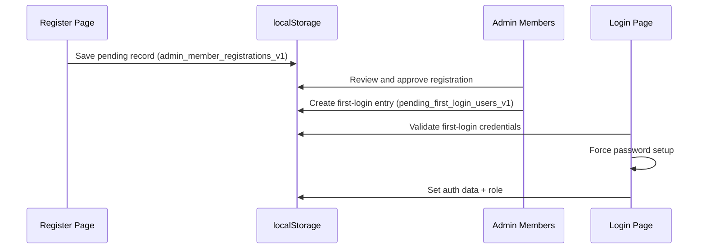

# Alumni Portal

Alumni Portal is a Next.js application for JNV alumni community operations.
It includes a public website, role-based login, admin workspace, and user workspace.

This README is fully updated to match the current codebase and workflows.

## 1. What This Project Does

The platform provides:

- Public information pages for alumni engagement.
- Role-protected admin and user dashboards.
- Frontend workflow simulation for member approvals, request handling, scholarship operations, analytics monitoring, and settings governance.
- A lightweight visitor counter API.

## 2. Current Feature Status

### 2.1 Public Website

Implemented pages:

- Home
- About
- Directory
- Events
- Jobs
- Mentorship
- Scholarships
- Donate
- News
- Share Story
- Team
- Contact
- Register
- Login
- Privacy
- Terms

### 2.2 Authentication and Route Protection

Implemented:

- Role-aware login for admin and user.
- Cookie-based route protection via `proxy.ts`.
- Redirect logic for unauthorized access.
- First-login password setup flow for approved users.

### 2.3 Admin Dashboard

Implemented admin sections:

- Overview
- Members
- Programs
- Events
- Requests
- Scholarships (routed through `/admin/finance`)
- Analytics
- Settings

Removed:

- Security section has been removed from sidebar and active admin module list.

### 2.4 User Dashboard

Implemented user sections:

- Overview
- My Profile
- My Network
- Mentorship
- Jobs
- Events
- Scholarships
- Messages
- Settings

## 3. Tech Stack

- Next.js 16.1.1 (App Router)
- React 19.2.3
- TypeScript 5
- Tailwind CSS v4
- Lucide React icons
- ESLint 9 + eslint-config-next

## 4. Project Structure (Key Paths)

```text
app/
  admin/
    [id]/page.tsx
    layout.tsx
    page.tsx
    settings/
      page.tsx
      AdminSettingsPanel.tsx
  user/
    [id]/page.tsx
    layout.tsx
    page.tsx
    settings/
      page.tsx
      UserSettingsPanel.tsx
  login/page.tsx
  register/page.tsx
  api/counter/route.ts
  components/
    Navbar.tsx
    Footer.tsx
    UniqueViewerCounter.tsx
proxy.ts
public/
  counter.json
```

## 5. Route Map

### 5.1 Public Routes

| Route | Purpose |
|---|---|
| `/` | Homepage |
| `/about` | About and mission |
| `/directory` | Alumni directory |
| `/events` | Events overview |
| `/jobs` | Career opportunities |
| `/mentorship` | Mentorship info and actions |
| `/scholarships` | Scholarship engagement page |
| `/donate` | Donation and contribution page |
| `/news` | Community updates |
| `/share-story` | Story sharing page |
| `/team` | Team and leadership |
| `/contact` | Contact and support |
| `/register` | Alumni registration flow |
| `/login` | Role-based login |
| `/privacy` | Privacy policy |
| `/terms` | Terms |
| `/api/counter` | Visitor counter API |

### 5.2 Admin Routes

| Route | Purpose |
|---|---|
| `/admin` | Admin overview |
| `/admin/members` | Member approvals and management |
| `/admin/programs` | Program management workflows |
| `/admin/events` | Event operations |
| `/admin/requests` | Request queue and assignment workflows |
| `/admin/finance` | Scholarship management workflows |
| `/admin/analytics` | Full visual analytics board |
| `/admin/settings` | Complete admin settings control center |

### 5.3 User Routes

| Route | Purpose |
|---|---|
| `/user` | User overview |
| `/user/profile` | Profile area |
| `/user/network` | Alumni connections |
| `/user/mentorship` | Mentorship space |
| `/user/jobs` | Jobs area |
| `/user/events` | User events area |
| `/user/scholarships` | Scholarship area |
| `/user/messages` | Messaging area |
| `/user/settings` | User settings panel |

## 6. Architecture Diagrams

### 6.1 High-Level Application Flow

```mermaid
flowchart LR
  Visitor[Browser User] --> App[Next.js App Router]
  App --> Public[Public Pages]
  App --> Login[Login and Register]
  Login --> Proxy[proxy.ts Route Guard]
  Proxy --> Admin[Admin Workspace]
  Proxy --> User[User Workspace]
  App --> CounterAPI[/api/counter]
  CounterAPI --> CounterStore[(public/counter.json)]
```

### 6.2 Registration to First Login



## 7. Authentication Workflow

### 7.1 Login Behavior

Current login behavior includes:

- Demo admin and demo user credential handling.
- First-login password reset for approved new members.
- Role-based redirect to `/admin` or `/user`.

### 7.2 Proxy Guards

`proxy.ts` currently enforces:

- Unauthenticated access to `/admin/*` or `/user/*` redirects to `/login`.
- Authenticated users visiting `/login` are redirected to role dashboard.
- Role mismatch redirects (`admin` trying user routes, or vice versa).

## 8. Main Operational Workflows

### 8.1 Registration to Member Approval Flow

1. User submits registration on `/register`.
2. Record is saved in browser storage as pending registration.
3. Admin reviews in `/admin/members`.
4. Admin approves or rejects.
5. On approval, frontend prepares first-login credentials and a simulated email event.

### 8.2 Request Queue Flow

Admin request workflows include:

- Open priority queue.
- Assign team.
- Close resolved batch.
- Per-request lifecycle actions (start, resolve, escalate).

### 8.3 Scholarship Management Flow

`/admin/finance` (Scholarships) includes:

- Scholarship creation.
- Donor to scholarship mapping with amount and cycle.
- Payment batch approval.
- Eligibility audit actions.
- Ledger export.

### 8.4 Analytics Monitoring Flow

`/admin/analytics` includes:

- Fully visual analytics board.
- Trend graph, pie chart, funnel, heatmap, and section comparison views.
- Date-range filter type:
  - 7d
  - 30d
  - 90d
  - custom (from and to date)
- Range-aware visualization behavior.

## 9. Admin Settings (Fully Implemented)

`/admin/settings` now uses `AdminSettingsPanel.tsx` and includes:

- General
- Access Control
- Workflow
- Notifications
- Security
- Data and Backup
- Integrations

Actions available:

- Save all settings
- Reset defaults
- Export settings JSON

Additional capabilities:

- Settings health scoring
- Utility controls for security and data operations
- Frontend persistence via local storage key `admin_settings_v1`

## 10. Local Storage and Cookie Keys

### 10.1 Cookies

- `auth_user`
- `auth_role`

### 10.2 Local Storage

- `auth_user`
- `auth_role`
- `auth_first_name`
- `theme`
- `has_visited_site`
- `admin_member_registrations_v1`
- `admin_email_outbox_v1`
- `pending_first_login_users_v1`
- `admin_settings_v1`

## 11. API

### 11.1 Visitor Counter API

Route: `/api/counter`

Behavior:

- Returns visitor count.
- Supports increment mode using query `increment=true`.
- Reads and writes `public/counter.json`.

Sample response:

```json
{
  "count": 1241
}
```

## 12. Development Setup

### 12.1 Prerequisites

- Node.js 20+
- npm

### 12.2 Install

```bash
npm install
```

### 12.3 Run Dev Server

```bash
npm run dev
```

URL:

- `http://localhost:3000`

### 12.4 Build and Start

```bash
npm run build
npm run start
```

### 12.5 Lint

```bash
npm run lint
```

## 13. Scripts

| Script | Command | Description |
|---|---|---|
| dev | `next dev` | Start dev server |
| build | `next build` | Production build |
| start | `next start` | Start production server |
| lint | `eslint` | Lint project |

## 14. Design and Engineering Rules

Project rules are defined in `project_rules.md`.

Important enforced rules:

- Use theme tokens, avoid hardcoded random colors.
- Keep dependency footprint minimal.
- Use `lucide-react` for icons.
- Prioritize performance.
- Build mobile-first.

## 15. Known Limitations

- Core workflows are frontend-simulated and not yet backed by persistent server APIs.
- Local storage is used for workflow continuity in development/demo mode.
- No production-grade authentication backend yet.

## 16. Recommended Next Steps

1. Connect admin and user workflows to real backend APIs.
2. Replace local storage workflow state with database persistence.
3. Add production authentication and session security.
4. Add automated tests for auth, approval, and scholarship payment flows.
5. Add CI pipeline for lint, build, and test checks.

## 17. Deployment

Recommended target: Vercel (or any Next.js-compatible Node hosting).

Typical flow:

1. Import repository.
2. Install dependencies.
3. Run build command `npm run build`.
4. Start with `npm run start` (for non-serverless environments).

## 18. Maintainers

Alumni Tech Team.